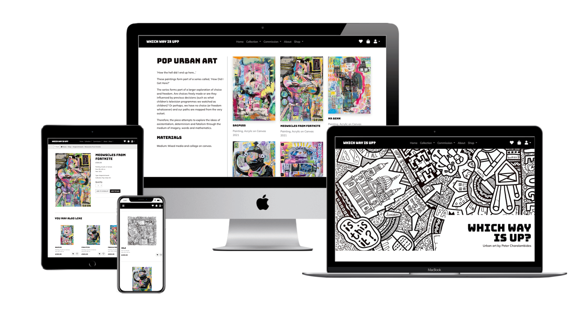
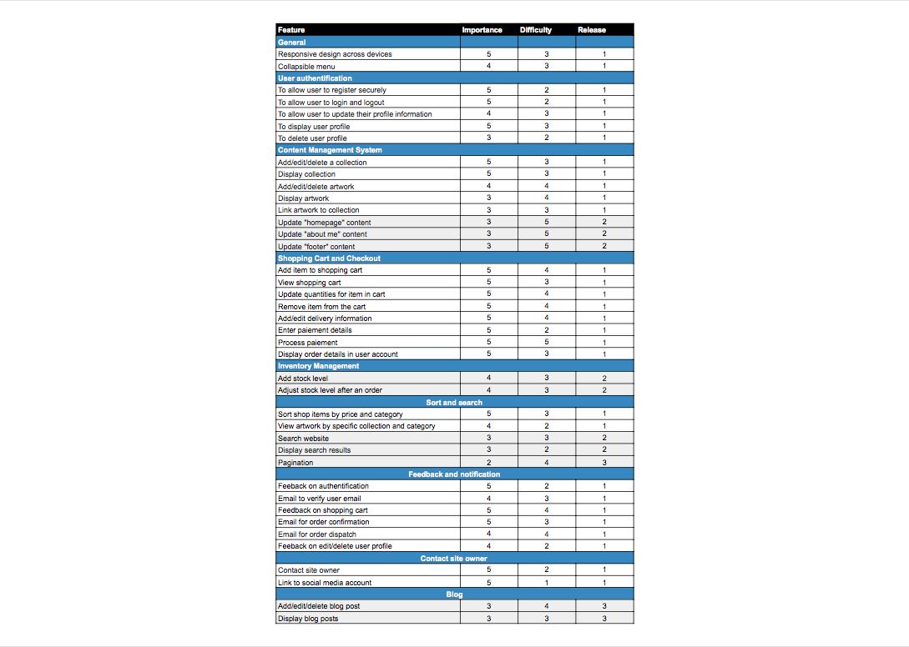
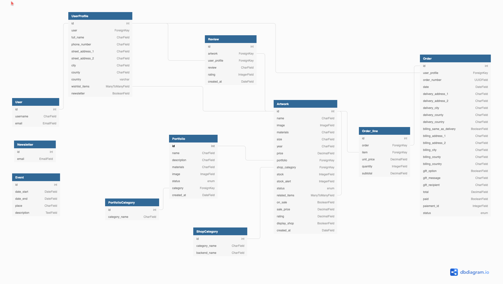
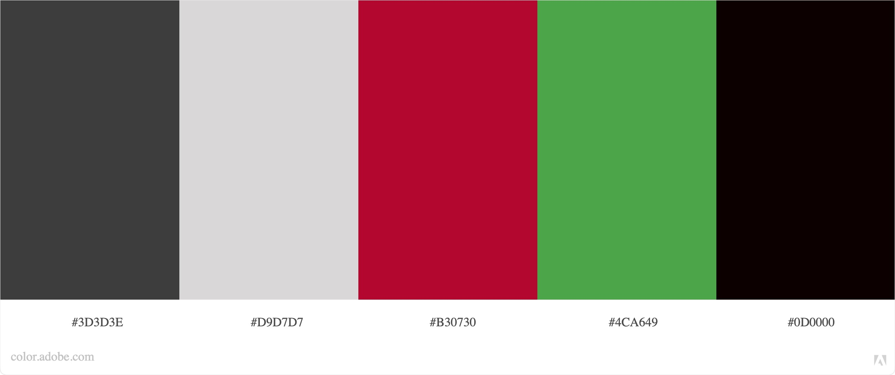
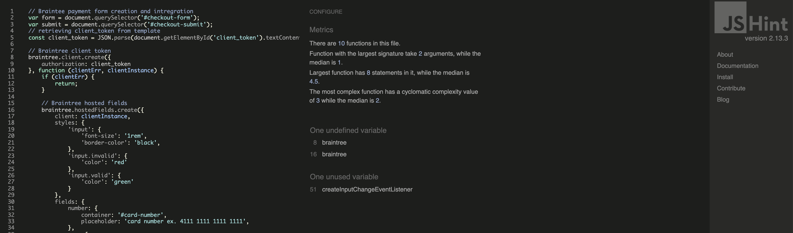
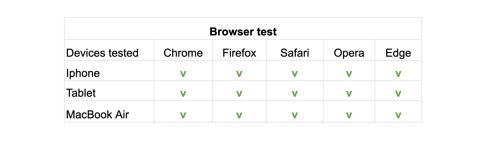
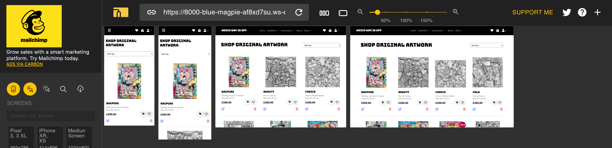
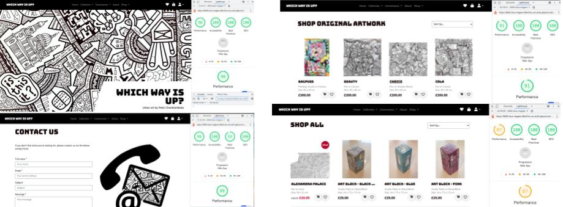
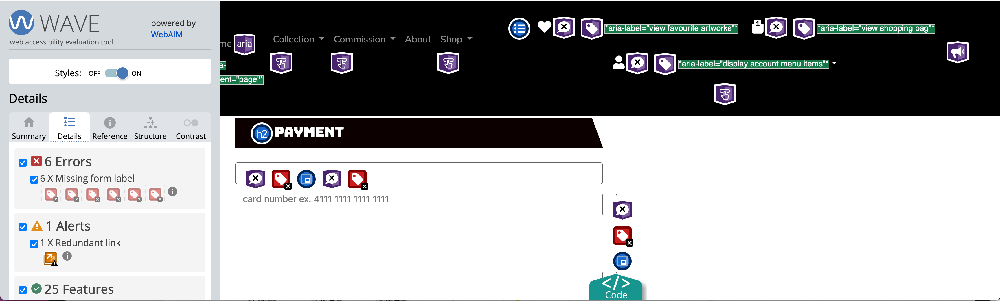

# **Which Way is Up**

## **INTRODUCTION** 



Which Way Is Up -  an online gallery and ecommerce website for artist Peter Charalambides - was created for educational purposes only as part of the Code Institute’s full stack development course.

Using the principles of UX design, this fully responsive and interactive website was developed using HTML, CSS, JavaScript and Python as well as Django as a framework.

View live project here [link to deployed link]

## **TABLE OF CONTENT** 

  - [UX Design](#ux-design)
    - [Strategy](#Strategy)
    - [User stories](#User-stories)
    - [Scope](#Scope)
    - [Structure](#Structure)
    - [Skeleton](#Skeleton)
    - [Design](#Design)
  - [Features](#features)
    - [Existing features](#existing-features)
    - [Features left to implement](#features-left-to-implement)
  - [CRUD operations and defensive design](#crud-operations-and-defensive-design)
    -[CRUD operations](#crud-operations)
    -[defensive design](#defensive-design)
  - [Technologies Used](#technologies-used)
    - [Languages](#languages)
    - [Databases platform and cloud storage](#database-platform-and-cloud-storage)
    - [Libraries and frameworks](#libraries-and-frameworks)
    - [Other technologies](#other-technologies)  
  - [Testing](#testing)
    - [Introduction](#introduction)
    - [Code validation](#code-validation)
    - [Testing User stories](#testing-User-stories)
    - [Automated testing](#automated-testing)
    - [Responsiveness and compatibility](#responsiveness-and-compatibility)
    - [Testing performance](#testing-performance)
    - [Testing accessibility](#testing-accessibility)
    - [Interesting issues and known bugs](#interesting-issues-and-known-bugs)
  - [Deployment](#deployment)
    - [Deployment of the page](#deployment-of-the-page)
    - [How to run the code locally](#how-to-run-the-code-locally)
   - [Credits](#credits)
     - [Code](#code)
     - [Content](#content)
     - [Media](#media)
     - [Acknowledgment](#acknowledgments)

## **UX DESIGN**

 - ### **Strategy**  

   Peter Charalambides is a London based artist operating under the umbrella Which Way Is Up and whose style sits within the urban art movement.
   
   Whilst Peter Charalambides’ breadth of work is versatile, he specialises in doodle art illustration on a wide range of mediums including furniture.  
   
   With over 1300 followers on instagram, Peter would like to revamp his website to showcase his portfolio and include an ecommerce shop where he can sell his art directly to the public.  
   
   Peter Charalambides offers original artwork as well as prints of his illustration, with a wide range of pricing, making his art accessible and affordable to all.
   
   - #### **Site owner goal**
     - To increase online presence 
     - To drive and connect with audience through the website
     - To tell artist story and profile by showcasing portfolio
     - Convert interest into sales 
   - #### **User goals** 
     - To access a user-friendly website across multiple devices 
     - To discover artist work and collections 
     - To buy prints and unique piece of arts
     - To contact and connect with the artist

 - ### **User stories** 

    1. **Navigation and website experience**
        - As a site user, I want a responsive website so that I can access it on different devices.
        - As a site user, I want to easily navigate across the site so that I can find the information I need.
        - As a site user, I want to read about the artist so that I can learn about artist background and exhibitions
        - As a site user, I want to view the artist work so that can understand the artist work
        - As a site user, I want to see the details for an artwork so that I can get a better appreciation and decide if I would want to buy it.
        - As site user, I want to engage with the artist work so that I can be part of the artist community

    2. **Shopping experience** 
        - As a shopper, I want to view all the artwork available so that I can quickly have an overview of what is on offer
        - As a shopper, I want to view available artwork by specific collection and category so that I can quickly find products I’m interested in.
        - As a shopper, I want to sort the list of artwork available so that I can find a piece in my price range
        - As a shopper, I want to view the artwork price and details so that I can make an informed decision
        - As a shopper, I want to read reviews so that I can have a better understanding of the quality of the artist work
        - As a shopper, I want to view related items so that I can purchase several artwork
        - As a shopper, I want to select quantity of an item if applicable so I can order what I need

    3. **Shopping bag and checkout**
        - As a shopper, I want to review items in my shopping bag so that I can adjust quantities ordered.
        - As a shopper, I want to have a gift option so I can buy a print / piece of art for a special occasion for a friend
        - As a shopper, I want to enter payment information in a safe and secure way so that I can checkout quickly with confidence
        - As a shopper, I want to receive confirmation of my order so that I can have a proof of purchase

    4. **Registration and account management** 
        - As a site user, I want to register for an account so that I can view my orders and my favourite items
        - As a site user, I want to login and logout so that I can access my profile safely 
        - As a site user, I want to edit my profile so that I can update my personal information
        - As a site user, I want to reset my password if I forgot it so that I can access my account
        - As a site user, I want to delete my profile so that my personal information are removed from the website

    5. **Favourite items and product review**
        - As a site user, I want to save artwork as my favourites so that I can buy it later or buy it again
        - As a site user, I want to leave a review so that I can let others know about my shopping experience

    6. **Contact and connect**
        - As a site user, I want to contact the site owner so that I can make queries about his work / request for a commission
        - As a site user, I want to follow the artist on social media so that I can keep up to date with his work

    7. **Admin and site management** 

        - As the site owner, I want to add, edit and delete a collection so that I can keep my portfolio and work up-to-date
        - As the site owner, I want to add, edit and delete individual artwork and items to that I can link them to collection and keep my shop up-to-date
        - As a site owner I want to add related product so that I can encourage multi-buy
        - As a site owner, I want to be able to edit most of the content of the website, so that I can keep my website up to date and engaging.
        - As a site owner, I want to manage orders from the console so I can know I have dispatched the order.

  - ### **Scope**
  
     - #### **Feature trade-off**

        

        A pdf version of the feature trade-off can been see [here](documentation/scope/Feature_trade_off.pdf)

        This website will be developed as a minimal viable product with room for future improvements and releases incorporating additional features.

     - #### **Functional requirements**
        - To be able to sign-up using email address and secure password
        - To be able to login and logout
        - To be able to add/view/edit/delete profile information
        - To be able to reset password 
        - To be able to add/view/edit/delete an collection
        - To be able to add/view/edit/delete a artwork
        - To be able to add/view/edit/delete reviews
        - To be able to create/view/edit/delete shopping bag
        - To be able to process orders
        - To be able to process paiement
        - To be able to sort shop items according to a set of criteria 
        - To be able to email notification to users
        - To be able to store and retrieve images 
        - To be able to contact the site owner 
        - To receive feedback for important actions: create - update - delete
        - To handle errors: page 404 not found, page 500 Internal Server Error page and page 403/403 

	  - #### **Non functional requirements**
         - Display artwork images and information in engaging way
         - Intuitive navigation and structure

     - #### **Content requirements**
       - Artist biography and key events/exhibitions
       - Information about the artist work 
       - Image library of artwork
       - Details for the artwork - size, price
       - Forms where user input is required
       - Engaging text and headings throughout to introduce main sections of the website
       - Icons for interactive and visual elements 

     - #### **Business rules**
       - Artwork can be added to a portfolio and not be available for purchase
       - Artwork can be available for purchase and not feature in a portfolio
       - Artwork and portoflio may be set as active, inactive or draft
       - Artwork cannot be deleted if it features in an order
       - Orders will be set as in progress and the shop owner to action orders as dispatched
       - Delivery are free and items can only be shipped to a UK address 

     - #### **Constraints**
	
       - Technical skills: The site owner is still learning Python and is new to Django Framework which may impact on the successful implementation of the planned features. 
       - Time: Implementing features using new technical skills will require time and careful planning, especially since the developer is now working full-time.

 - ### **Structure**

     - #### **Organisation of functionality and content**

        - Header: Logo and a collapsible menu with navigational links
        - Homepage: Give an overview of the artist universe including Hero image, featured collection, downloadable colouring page and reviews
        - About: Information about the artist
        - Work: Display artist portfolio and image library
        - Shop: Display artwork, prints and other items for sale
        - Product page: Display artwork details
        - Shopping bag: Display items added in the bag
        - Footer: Contact form, links to social media and policies

     - #### **Interaction design**

        - Collapsible menu
        - Artwork image with hovering effect
        - Buttons and icons with hovering effect

     - #### **Database structure**

        The diagram below illustrates the database structure used in this project, first managed using SQLite during the development process, then Postgres in production with Heroku. A pdf version can be seen [here](documentation/structure/db_revised_structure.pdf).

        

        The schema has been revised and the intial database structure can be found [here](documentation/structure/db_structure.pdf)

        - **User**
          - Stores a users registration information provided upon signing up
          - Information from the User Model is used to create the UserProfile upon signing up

        - **UserProfile model**
          - Stores detail information about user such as full name, phone number, address that can be retrieved at checkout or when contacting the shop owner
          - Stores wishlist items using many-to-many relationship with artwork model
          - This model is related to orders and reviews to easily retrieve users order details and reviews

        - **PortfolioCategory model**
          - Stores category name for portfolio
          - Is used to generate dynamic nav bar menu ang group portfolios together

        - **Portoflio model**
          - Stores detailed information about a portfolio to be displayed in portfolio pages such as name, description, materials, image and status
          - Status information is used to decide whether the portfolio is displayed or not
          - Related with artwork model to display image library 
        
        - **ShopCategory model**
          - Stores category and category back end name
          - Used to generate dynamic shop's dropdown menu and shop pages
          - Used to retrieve list of artwork to be displayed on relevant shop pages

        - **Artwork model**
          - Stores detailed information about an artwork to be displayed in artwork detail page, such as name, image, size, price ...
          - Features stock information with stock adjustment upon successful checkout. Stock information is also used to display dynamic quantity options and whether the artwork can be added to bag or not. 
          - Features an optional stock alert used to inform the shop owner if stock reach a critical level.
          - Status is used to decide wether artwork can be displayed, added to wishlist and bag as well as whether reviews can be added for that artwork.
          - Status is also used to override delete method if an artwork features in any order_lines
          - Feature a boolean and decimal field for displaying sale price and overriding artwork's default price
          - Feature a many-to-many relationship to self to select related products
          - Rating field auto-populate and average of all reviews for that artwork
          - Related to Portfolio and ShopCategoy model to easily retrieve information

        - **Order model**
          - Stores all the information related to a successful order made by a user, including order number, delivery and billing details
          - Stores if there's a gift option as well as gift recipient and gift message
          - Stores if paiement was successfully made as well as Braintree paiement id 
      
        - **Order_line model**
          - Stores details that have been added to the user’s bag, such as artwork name, price and quantity
          - Takes information from the artwork model to artwork detail to the user’s order.
          - Information from the Order_line is sent to the Order model to update the order.

        - **Review model**
          - Stores review details information about an artwork 
          - Information from the Review model is sent to the Artwork model using a signal to update average rating
          - Related to artwork and order_line model to verify wether the user is leaving a review for an item that has been purchased
          - Related to UserProfile to easily retrieved information to be displayed in my reviews

        - **Event model**
          - Stores detailed information about an event (can be an exhibition, event...) such as start date, end date, place and description.
          - Used to be display in event section in about page

 - ### **Skeleton**
    
    - ### **Wireframes**

       

       Please find all the wireframes in pdf format [here](documentation/wireframes/wireframes.pdf). 
    
       Please find below links to a selection of wireframe for this project (png format)
         - [Homepage menu](documentation/wireframes/homepage_menu.png)
         - [Work](documentation/wireframes/work.png) 
         - [Collection details](documentation/wireframes/collection_details.png)
         - [About page](documentation/wireframes/about.png)
         - [Shop](documentation/wireframes/shop.png)
         - [Artwork details](documentation/wireframes/artwork_details.png)
         - [Shopping bag](documentation/wireframes/shopping_bag.png)
         - [Checkout page](documentation/wireframes/checkout_page.png)
         - [Order successful](documentation/wireframes/order_successful.png)
         - [Saved items](documentation/wireframes/saved_items.png)
         - [Sign up page](documentation/wireframes/signup.png)
         - [Login page](documentation/wireframes/login.png)
         - [Profile page](documentation/wireframes/profile.png)
         - [Add artwork](documentation/wireframes/add_artwork.png)
         - [Add collection](documentation/wireframes/add_collection.png)
         - [Contact us page](documentation/wireframes/contact.png)
         - [Error page](documentation/wireframes/error_pages.png)
         - [Policy page](documentation/wireframes/policy_pages.png)

    - #### **Difference to design**
      - Sections in the profiles pages feature on their own dedicated pages
      - Collection details (portfolio) feature a panel of the left with the portfolio details and a panel on the right the image library
      - Work page wasn't implemented as not needed
      - Items in shop page features additional buttons
      - Saved items has been renamed wishlist
      - Line items in shopping bag layout has been adjusted for better user experience.

 - ### **Surface / Design** 

     The website will feature a simple, modern and engaging design, with a minimum of colours to keep the emphasis on the artist's work.

    - #### **Imagery**

       The website will solely feature images from the artist's artwork. 

    - #### **Colour scheme**
 
       Since the artwork is either black and white or very colorful, the website will use mostly black and white with an some additional colours for interactive purposes (such as hovering effect) and feedback to site visitors / shoppers. 

       The website will use the following colour palette, which was custom-made and checked for accessibility using Adobe Color:

              

     - #### **Typography**
        The website will use the following fonts from Google:
        - [Bungee](https://fonts.google.com/specimen/Bungee#about) will use Bungee for its urban style in line with the artist's overall style 
        - Body: [Mulish](https://fonts.google.com/specimen/Mulish?query=mulish#glyphs) for its minimalist and light style in sharp contrast with the headers.

     - #### **Icons**
       Icons by font-awesome will be used in the navigation bar to allow users to quickly access functionalities offered by the website such as the shopping cart / 

     - #### **Styling**
        - Horizontal lines to structure and make the content of the website easy to read.
        - Slightly rounded edge borders and buttons for a more user friendly and inviting interface.
        - Some light shadows to add further dimension and depth to the website.

     - #### **Design issues** 
        The image library in collection and commission sections is looking at presenting the images in their aspect ration. Whilst it works relatively well when there are many images, it does look a bit odd when there are only a few items to display. Ideally the developer would have liked to implement a masonry layout.

## **FEATURES**

  - ### **Existing features**
  
    Implemented features can be found in [this document](documentation/features/features.md).
 
  - ### **Features left to implement**
  	- Additional thumbnail images for product details 
  	- Pagination on shop when displaying all items 
  	- Full content management to display and update content on the homepage and other static pages
  	- Improved user interface for the super admin to manage store, orders and content of the website
  	- Ability to share artwork on social media
  	- Add a blog where artist to add/edit/delete post about his creative process and other work.

## **CRUD operations and defensive design**

  - ### **CRUD operations**
    Operations | all user | auth. user | super user |
    --- | --- | --- | --- 
    View homepage | Yes | Yes | Yes |
    View about page | Yes | Yes | Yes |
    Add event | No | No | Yes |
    Edit event | No | No | Yes |
    Delete event | No | No | Yes |
    View portfolio pages | Yes | Yes | Yes |
    Add/edit/delete categories | No | No | Yes |
    Add/edit/delete a portfolio | No | No | Yes |
    View artworks (shop) | Yes | Yes | Yes |
    View artwork details | Yes | Yes | Yes |
    Add/edit/delete shop categories | No | No | Yes |
    Add/edit/delete artwork | No | No | Yes |
    View add to bag | Yes | Yes | Yes |
    Add item to bag | Yes | Yes | Yes |
    Update item to bag | Yes | Yes | Yes |
    Remove item to bag | Yes | Yes | Yes |
    Checkout page | Yes | Yes | Yes |
    Login | No | Yes | Yes |
    Register | Yes | No | No |
    View profile | Yes | Yes | Yes |
    Edit profile | No | Yes | Yes |
    Delete profile | No | Yes | Yes | 
    View wishlist | No | Yes | Yes | 
    Add to wishlist | No | Yes | Yes |
    Remove from wishlist | No | Yes | Yes |
    View order history | No | Yes | Yes |
    View order details | No | Yes | Yes |
    View my reviews | No | Yes | Yes |
    View all reviews | Yes | Yes | Yes |
    Add a review | No | Yes | Yes |
    Edit a review | No | Yes | Yes |
    Delete a review | No | Yes | Yes |

  - ### **defensive design**

    - #### **Delete operations**
      Users first need to confirm that they are sure they want to delete the specifified item (artwork, portfolio, reviews and event)

    - #### **Adding quantity of specified item to shopping bag**
      - The options for quantity to be added to shopping bag are limited to stock availability 
      - Users cannot add an item out of stock to their shopping cart and the button 'add to cart' to be removed from page
      - Users cannot add an item who status is not active to their shopping bag

    - #### **Artwork and portoflio status**
      - If artwork is set as inactive / draft:
        - Artwork will not be displayed in portfolio pages
        - Artwork will not be displayed in shop pages
        - Artwork detail page will not be accessible to users except the super admin
        - Artwork cannot be added to shopping bag and wishlist
        - Artwork will be removed from any wishlist they have been added to & users will be notified by email
        - Artwork will be removed from shopping bag and users will be notified when they next access their shopping bag or checkout page.
      - If portfolio is set as inactive / draft:
        - Portfolio will not be displayed in the dynamically generated nav bar
        - Portfolio page will not be accessible to users except for the super admin

    - #### **Add/edit/delete artworks**
      - Conditions in place to ensure that on superuser can add/edit/delte artworks
      - If an artwork has been purchased, it cannot be deleted and status will be set as inactive instead

    - #### **Add/edit/delete reviews**
      - Users can only add reviews for items that they have purchased and reviews will also be related to the order line in checkout orders
      - Users can also only add reviews for items still active, but can edit and delete reviews wehter the items is active or not

    - #### **Checkout page**
      - Users can only have a delivery address set in the UK and if the country selected is anything other than UK an error message will display.

## **TECHNOLOGIES USED**

  - ### **Languages**
    - [HTML](https://html.spec.whatwg.org/multipage/)
    - [CSS](https://www.w3.org/Style/CSS/Overview.en.html)
    - [Javascript](https://developer.mozilla.org/en-US/docs/Web/JavaScript)
    - [Python](https://www.python.org/)

  - ### **Databases platform and cloud storage**
    - [SQlite](https://www.sqlite.org/index.html): SQL database engine provided by default as part of Django and used development
    - [Heroku Postgres](https://devcenter.heroku.com/articles/heroku-postgresql): SQL database service provided directly by Heroku for storing data
    - [Amazon AWS S3]: to store images and static files in production
    - [Heroku](https://www.heroku.com/): to deploy and run the application in production

  - ### **Libraries and frameworks**
    - [Django](https://www.djangoproject.com/): Python web framework for rapid development and clean, pragmatic design
    - [Gunicorn](https://gunicorn.org/): WSGI HTTP Server to support deployment of Django application
    - [Jquery](https://jquery.com/): to simplify Ajax, DOM manipulation and event handling
    - [Bootstrap5](https://getbootstrap.com/docs/5.0/getting-started/introduction/): for responsive grid and general layout
    - [Font Awesome](https://fontawesome.com/): used for icons throughout the website
    - [Google font](https://fonts.google.com/): used for body and headings font
    - [Crispy form](https://django-crispy-forms.readthedocs.io/en/latest/): to manage rendering behaviour and layout of Django forms
    - [Bootstrap 5 crispy](https://github.com/django-crispy-forms/crispy-bootstrap5): Boostrap5 template for Dango Crispy Forms
    - Django-countries: countries that already has a pre-built country field containing all the valid country codes. 
    - [Pillow](https://pillow.readthedocs.io/en/stable/): for image processing
    - [Django_case_insensitive_field](https://pypi.org/project/django-case-insensitive-field/): to allow case insensitive comparison for unique fields
    - [Django cleanup](https://pypi.org/project/django-cleanup/): to automatically delete images / files when an ImagField is removed / updated or deleted

  - ### **Other technologies**
    - [Tinyjpg.com](https://tinyjpg.com/): to compress images
    - [Balsamiq](https://balsamiq.com/): to design wireframes
    - [Dbdiagram.io](https://dbdiagram.io/home): to design schema of relational database
    - [W3C Markup Validation Service](https://validator.w3.org/): to check there's not error in HTML
    - [W3C CSS Validator](https://jigsaw.w3.org/css-validator/): This tool was used to check there's no error in the CSS code.
    - [WAVE Web Accessibility Evaluation Tool](https://wave.webaim.org/): This tool was used to evaluate accessibility of the webiste.
    - [PEP8 online](http://pep8online.com/): to validate python syntax
    - [JSHint](https://jshint.com/): to validate jquery/javascript syntax
    - [Chrome DevTools](https://developer.chrome.com/docs/devtools/): Google inspect was used to test and fix code and page responsiveness.
    - [Google lighthouse](https://developers.google.com/web/tools/lighthouse): Google lighthouse was used to assess performance of the site


## **TESTING**

  - ### **Introduction**
    The website was extensively tested as it was developed with the implementation of new features, using:
    - console.log() and google developer tools
    - terminal for backend functionalities by printing expected outcome
    - Manual testing of user stories

  - ### **Testing User stories**
    User stories were tested manually and details can be found here:

    [Go to testing user stories](documentation/testing/user_stories.md)

  - ### **Code validation**

    - #### **W3C HTML Code Validator**
      Each page for the website was run through the [W3C Markup Validation Service](https://validator.w3.org/) and returned no errors. 
      As all web pages are rendered dynamically using Jinja template, each page and scenario had to be validated by direct input by copying and pasting the source code for the page.

    - #### **W3C CSS Jigsaw Validator**
      The CSS file was tested with [W3C CSS Validator](https://jigsaw.w3.org/css-validator/) via direct input and returned no errors

    - #### **JSHint validator**
      All javascripts files were tested with [JSHint](https://jshint.com/) and returned no errors except for braintree scripts for hosted fields, especially scripts for fields validation. Since the scripts will be actionned for the fields hosted in an iframe, the developer left the scripts as they are.

      

    - #### **Python 8**
      Each python file was run through [PEP8 online](http://pep8online.com/) and returned no errors, except for settings.py and password validation section.

  - ### **Responsiveness and compatibility**
    The website was tested on the following devices and browsers:
    

    Prefixes needed to be added to clip-path as trapezeoid shapes did not render on tablets regardless of the browser.

    The website was also tested using Google Inspect and Responsive viewer
    

  - ### **Testing performance**
    Google Lighthouse was run on different pages, with performances ranging from 83% to 100% depending on the number of images on the pages. The page with lower performance is the shop page with all products displayed. Below is an extract of the reports:

    

  - ### **Testing accessibility**

    Since the website was developed using Django templating, each page was tested individually for accessibility with [WAVE Web Accessibility Evaluation Tool](https://wave.webaim.org/) and returned no errors except for Braintree hosted fields as the accessibility tools cannot identify labels for these fields.
    
    

    Since these fields displayed in an iframe and after trying to add additional options such as 'internalLabel', the errors remained and the developer decided to keep the scripts as they are.

  - ### **Interesting issues and known bugs**

    - #### **Context processor and all auth template**
      
      As the newsletter form is rendered in the base template and accessible across the website, it was put in a context processor. At first return if post request is get, which must have override functionalities within all auth and as the result, if there were any errors in the login or whilst registering - it would throw a NoneType error. The solution was to remove if request is get & also renaming file - to make sure - it doesn’t override allauth functionalities 

    - #### **Display crispy form in two columns - profile**
      
      One of the issue was to render to profile form in two column using the crispy form functionalities. At first two form, but that would have created issues with the post action. So used crispy layout to design the form in the backend. 

    - #### **Beautifying code and if statement in form input attribute**
      The developer had to be careful checking for django template variable being cut-off when beatufifying the code and causing errors when running the application. 

    - #### **Gitpod workplace**

      - **Gitpod workplace opening to previous version of project**
        On 03/01/22 the workplace for this project opened to a previous version showing changes that has been previously committed and pushed. Upon further inspection, many other files were missing and it became apparent that the workspace opened to a previous version of the project. 

      - **Step taken to resolve the issue**
        - Commit the changes on the workplace
        - Pull from origin main
        - Merge conflicts
        - Commit and push to origin main
        - Run the application to check for any issues and adjust settings to remove star ratings, which was previously installed and removed

      - **Change to gitpod and Code Institute template**

        When gitpod updated their platform, it inadvertently affected the workspace and the template developed by Code Institute used for this project, whereby affecting the packages installed for running the application.

        Following the previous with the workspace, the developer took the opportunity to follow the recommendations to open a new workspace with the updated Code Institute template by taking the following steps:
          - Export the current database following this tutorial (the dump was included
          - Fix the current requirements and override the dockerfile as recommended by Code Insitute
          - Open a new workspace using the new CI template 
          - Upload the sqlite from previous workspace to new workspace

      - **Django variable to javascript**

        For ease and having had some initial issues with connecting the static javascript files, the developer included scripts at the bottom of the html file. Since it’s cleaner to have the scripts in static files, scripts were moved to respective static files. The connection issue was resolved by closing the server and reopening it.

        For the checkout app, the client token variable needed to be retrieved from the html template. After some research, the solution was to use json_script as per suggestion in this [stack overflow post] (https://stackoverflow.com/questions/298772/django-template-variables-and-javascript) and using this [django documentation](https://docs.djangoproject.com/en/4.0/ref/templates/builtins/#json-script)

        Html template:
        ```
        {{ client_token|json_script:'client_token' }}
        ```
        Javascript
        ```
        const client_token = JSON.parse(document.getElementById('client_token').textContent);
        ```

    - #### **Known issues**

      Known issues are those raised in the accessibility report and formating of javascript for Braintree hosted fields. Other than that, all Braintree functionalities works as intended and error messages are displayed properly.

      Also should the developer add an order from the admin platform, the stock will not deduct, although the shop owner should not add orders from django admin platform and maybe this option should be removed entirely.
 
## **DEPLOYMENT**

## **CREDITS**

  - ### **Code**
    - About page event section styling adapted from [Code Institute CV mini-project](https://github.com/Code-Institute-Solutions/resume-miniproject-bootstrap4/tree/master/16-adding-work-history)
    - Trapezoid background shapes inspired from https://bennettfeely.com/clippy/
    - Toasts small triangles adapted from [CSS-tricks](https://css-tricks.com/snippets/css/css-triangle/)
    - Getting last n records from django queryset adapted from this [stack overflow post](https://stackoverflow.com/questions/20555673/django-query-get-last-n-records)
    - Implementation of Django date input widget adapted from [stack overflow post](https://stackoverflow.com/questions/61076688/django-form-dateinput-with-widget-in-update-loosing-the-initial-value)
    - [stack overflow post](https://stackoverflow.com/questions/43990154/braintree-jsv3-payment-method-nonce-value-bad-with-hostedfields?rq=1)
    - Implementation for Braintree hosted fields validation from [Braintree code recipe](https://codepen.io/braintree/pen/zeamxM)
    - Discarding rows in tabular inline table implemented from this [stack overflow post](https://stackoverflow.com/questions/37338925/django-tabularinline-discard-empty-rows)
    - Implementation of contact form adapted from [official Django documentation](https://docs.djangoproject.com/en/4.0/topics/forms/)
    - Implementing unique boolean field in portfolio app adapated from this [Stack overflow post](https://stackoverflow.com/questions/1455126/unique-booleanfield-value-in-django)
    - Template tag for calculating estimated delivery date adapted from this [Stack overflow post](https://stackoverflow.com/questions/19598213/generating-a-date-relative-to-another-date-in-django-template)
    - Rendering textfield data in template adapated from this [stackoverflow post](https://stackoverflow.com/questions/10270891/newline-in-models-textfield-not-rendered-in-template)
    - Restricting Django country list adapted from [pypi.org documentation](https://pypi.org/project/django-countries/#customize-the-country-list)

  - ### **Media and content**
    - All images and contents for this website have been provided by the artist himself, Peter Charalambides.
    - Card icons on checkout page from [Aaron Fagan](https://github.com/aaronfagan/svg-credit-card-payment-icons/)

  - ### **Additional Content**
    - Accessibility statement is from [W3C Web Accessibility Initiatlive](https://www.w3.org/WAI/planning/statements/minimal-example/)
    - Privacy policy generated by and adapted from [FreePrivacyPolicy](https://www.freeprivacypolicy.com/free-privacy-policy-generator/)
    - Terms and conditions generated and adapted from [Termly](https://app.termly.io/builder/websites/0e418e55-2145-4384-b941-1e5af44699ae/documents/1595101/Company/Contact%20Information)

  - ### **Acknowledgments**
    - My mentor Akshat Garg for his advice and guidance during this project,
    - Peter Charalambides for his trust and allowing me to develop his website
    - Code Institute tutor services for their advice and support,
    - The Code Institute slack community for support and advices
