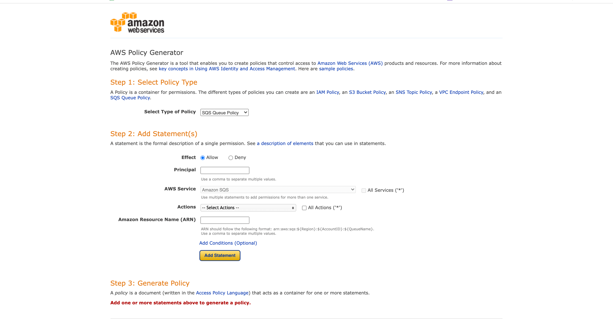
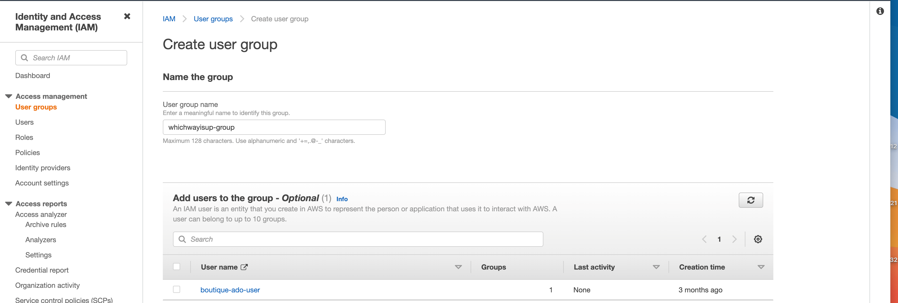

# Amazon S3 Bucket creation and configuration

This project uses the cloud-based storage service Amazon Web Services s3 to store static files (css, javascript) and images. The following instructions explains how to create and configure a bucket, group and user for the purpose of this project.

[Return to main ReadMe](/README.md#create-amazon-aws-s3-bucket)

- ## **Create a new bucket**
  - Open s3 and create new bucket, which will be used to store the static files
  - Give a name and select the region closest to you 
    
  - Uncheck "block all public access" and acknowledge that the bucket will be public (to allow public access to static files)
    
  - Click create bucket


- ## **Add settings to bucket**

  - ### **Set Static Web Hosting**
    - Go to the "properties" tab and find the website hosting tab at the bottom of the page
      
      
    - Enable static website hosting
    - Select host of a static website
    - Enter "index.html" for the index document
    - Enter default value of "error.html" for the error document section
    - Click save
      
   
   - ### **Set permissions by navigating to the permissions tab**
   
      1. **Configure CORS**
      Go to Cross-origin resource sharing (CORS) & add the following CORS configuration which is going to set up the required access between the Heroku app and the s3 bucket.
	       ```
	         [
  		      {
      		   "AllowedHeaders": [
          		  "Authorization"
      		   ],
      		   "AllowedMethods": [
          		"GET"
      		   ],
      		   "AllowedOrigins": [
          		"*"
      		   ],
      		   "ExposeHeaders": []
  		       }
	         ]
	       ```
	   
      2. **Go to the bucket policy tab**
	        
	        - Select policy generator
	        	- For policy type, select s3 bucket policy
          		- Allow all principals by using a star. ```*```
          		- For the action select ```get object```, 
          		- Copy and paste the ARN (Amazon Resource Name) from the tab properties > bucket overview in the ARN box
                 
          	- Click "Add statement"
          	- Then "click generate policy"
              
          	- Copy and paste the policy JSON document into the bucket policy editor.
          	- Add a ```/*``` at the end of the resource key to allow access to all the resources in the buck
          	- Click save
              
              
	    
       3. **Configure "Access Control List (ACL)"**
          - Go to the "Access Control List" tab under permission
          - Set the list of objects permission for everyone under the "Public Access" section
            

- ## **Create a user under IAM (Identity & Access Management)**

  - ### **Accesss IAM**
    - Go to services menu 
    - Search for service called IAM, which stands for Identity and Access Management.
    - Open IAM
      
      
  - ### **Create a group**
    - Go to the "User groups" tab in the left hand side menu
    - Click "Create group" and give it a name - ex whichisup-group
    - Click "Next Step", then "Next Step" again 
    - Click on "Create Group"
      
      
  - ### **Create Access Policy**
    - Click on policies on the left hand side menu
      
    - Click on "Create Policy"
    - Go to the JSON tab
      
    - Select "import managed policy"
    - Search S3 and select "AmazonS3FullAccess"
    - Click import
      
    - Get the ARN from the bucket policy page in S3
    - Copy and paste under resource
    - Click review policy.
    - Give it a name and a description.
      
    - Then click "create policy."
    - This step should take you back to the policies page where the policy created should be displayed
      
  
  - ### **Attach the policy to group**
    - Go to group and click on your group (ex wichwayisup-group)
    - Go to permission
    - Click on tab "Add permissions" then click on "Attach Policies" from the dropdown menu
      
    - Search for the policy (ex whichwayisup-group-policy)
    - Click attach policy.
  
  - ### **Create a user in the group**
    - Go to users from the left hand side menu 
    - Click on "Add Users"
      
    - Give is a name - ex whichwayisup-user
    - Check "Accesskey - programmatic access" under the  select AWS credentials tab
      
    - Select next
    - Select tab "Add user to group" and select relevant group (ex whichwayisup-group)
    - Click through to the end and then click create user.
    - Download the CSV file which contains this users access key and secret access key    
      (**Please note it's very important you download and save this CSV now as you won't be able to do so once the group has been created**)
