# FEATURES

  [Return to main ReadMe](/README.md#features)

 - ## **Responsive website**
 
    The layout and menu of the website will resize according to the device used for better visibility and user experience. The navigation is collapsible on mobile devices for better visibility.

    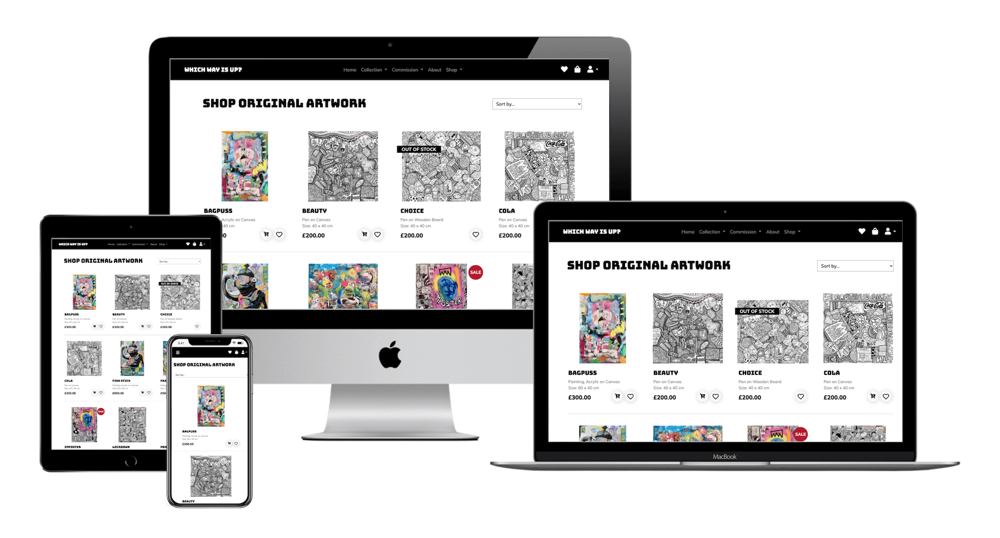

    - ### **User stories**
      > - As a site user, I want a responsive website so that I can access it on different devices.   
  

 - ## **Dynamic and collapsible navigation bar**
   
    The website features a navigation menu on top of the page to allow users to easily navigate throughout the website. The navigation is also collapsible on mobile devices for better visibility.
    
    Once a user is logged in, the navigation menu will update to allow users to access all features related to them such as their profile page or adding items if the user is the shop owner. 
    
    If a user has an item in their shopping bag, quantities in the shopping bag will display next to shopping cart icon.
    
    The navigation bar will be partly populated dynamically when the shop owner adds additional types of portfolio (in the same way as commission and collection). Each dropdown menu will also be dynamically populated so that the shop owner can keep the website up-to-date.

    

    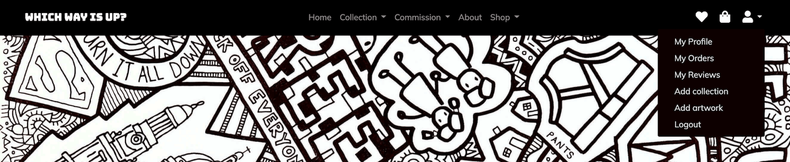

    - ### **User stories**
      > - As a site user, I want to easily navigate across the site so that I can find the information I need.

 - ## **Homepage**
    
    The homepage features a hero image giving a broad overview of the artist's work, as well as a featured collection and a section where user will be able to download a colourable sheet. The homepage also features a selection of reviews for the website with a button redirecting to a review page.

    The featured collection is populated dynamically according the shop owner selection when managing his portfolios and also feature a link redirecting to the portfolio page.

    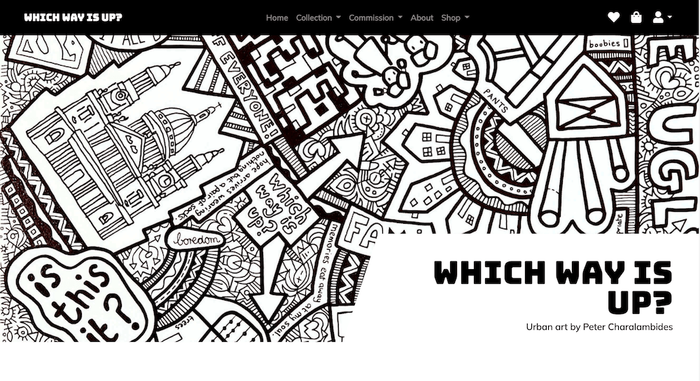

    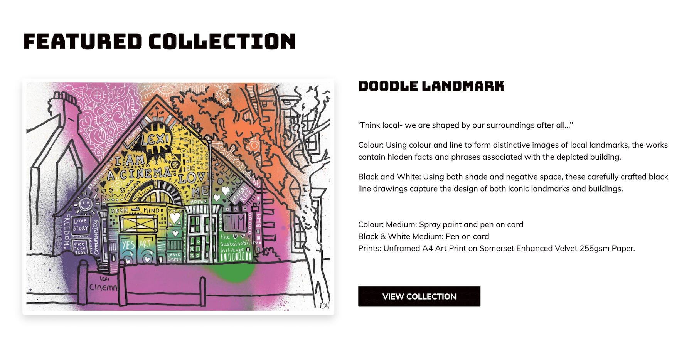

    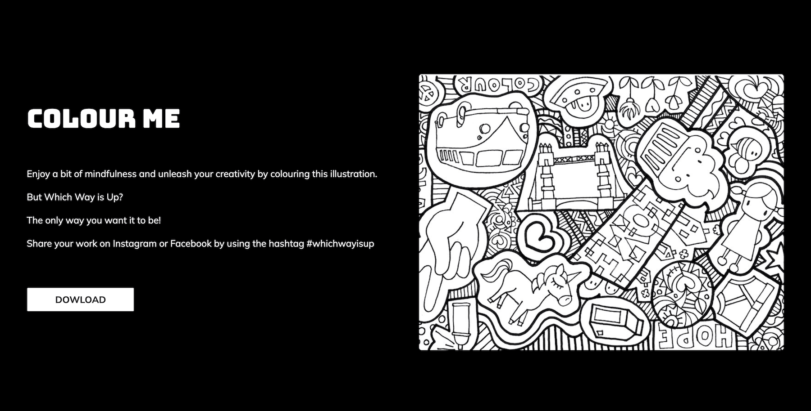

    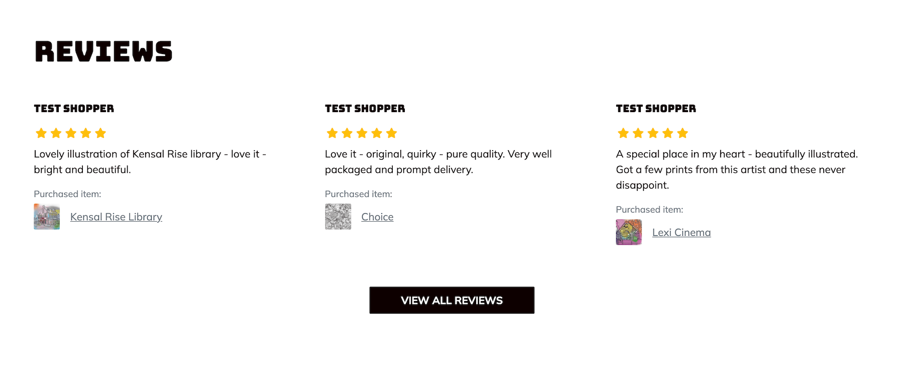

    - ### **User stories** 
      > - As site user, I want to engage with the artist work so that I can be part of his community
      > - As a shopper, I want to read reviews so that I can have a better understanding of the quality of the artist work

 - ## **Footer**
    
    The footer features useful links to policies as well as a button opening a contact page allowing the user to contact the website owner by completing a form. 
    
    The footer also features icons with links to social media accounts opening in a different tab as well as a form to sign up to a newsletter to allow users to join the artist's online community.

    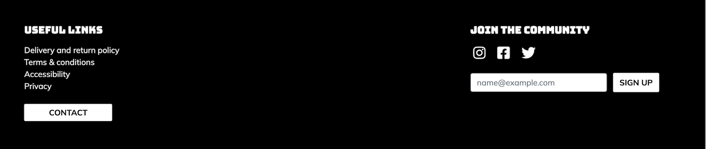

    - ### **User stories** 
      > - As site user, I want to engage with the artist work so that I can be part of his community
      > - As a site user, I want to contact the site owner so that I can make queries about his work / request for a commission
      > - As a site user, I want to follow the artist on social media so that I can keep up to date with his work

 - ## **Contact page**
   
    The contact page features a form allowing users to send an email to the shop owner. If a user is already signed-in, their email address will be populated automatically.  
    
    Upon submitting the form, an email should be sent to the site owner and a notification informing the user that the message has been successfully sent should display a the top of the page.

    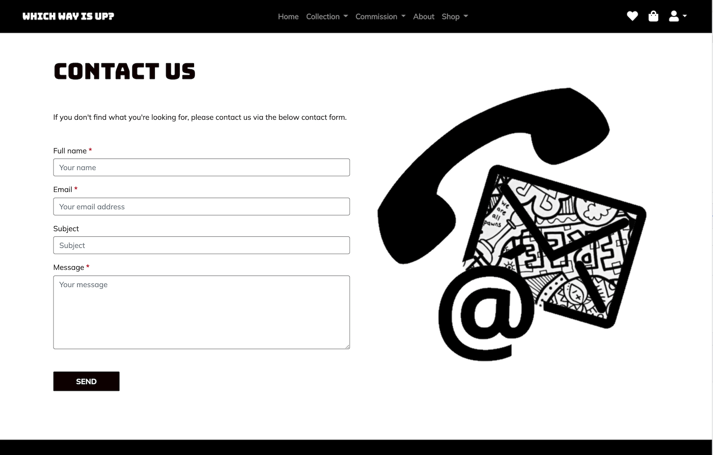

   - ### **User stories**   
     > - As a site user, I want to contact the site owner so that I can make queries about his work / request for a commission

 - ## **About page**
   
   The about page features an image and a biography about the artist as well as past and upcoming exhibitions to allow users to learn about the artist background and story.
   
   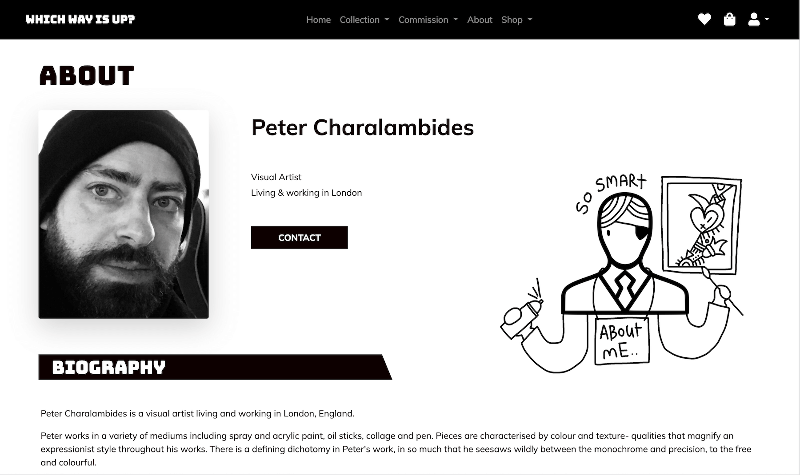
   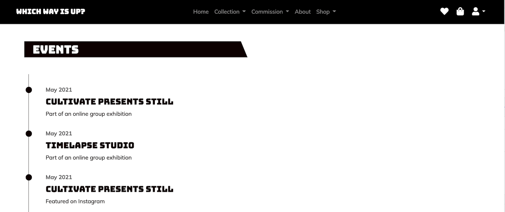

   - ### **User stories**
     > - As a site user, I want to read about the artist so that I can learn about his background and exhibitions

  
 - ## **Portfolio pages**
   
   The porftolio pages, including collection and commission, feature a short desciption as well as an image library of the artwork attached to this collection. When hovering on each image in the library, a set of three buttons will be displayed as follows:
    - A zoom icon to display the image full screen 
    - A heart icon to allow users to add the artwork to their wishlist  wishlist 
    - An information icon to redirect users to the artwork detail page
   
   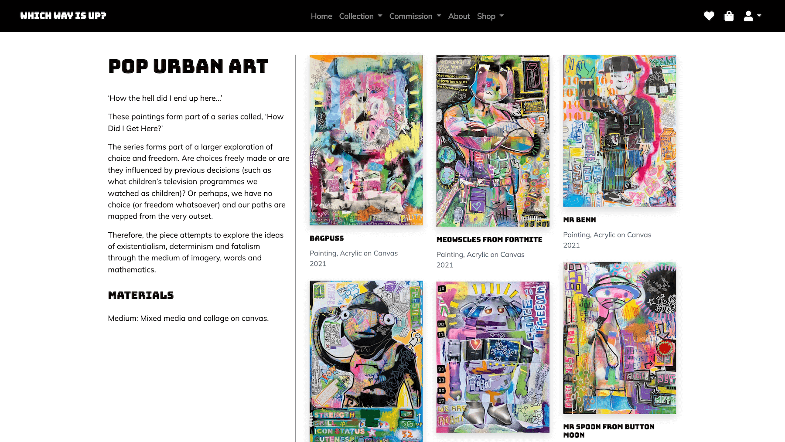
   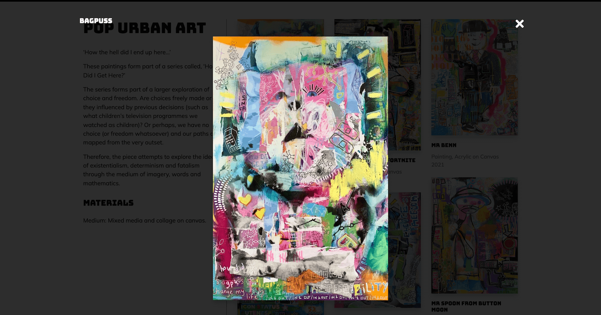

   - ### **User stories**
     > - As a site user, I want to view the artist work so that can understand what his art is about
 

 - ## **Artwork detail page**
  
   The artwork page is accessible from the online shop, collection and commission pages. It features all relevant details for a specific piece of art, such as materials, sizes and prices.  The artwork page also features related artworks and a product review section.
  
   If the artwork is available from the store, users will be a able to select from available quantity and add the artwork to their shopping bag. Out of stock items will feature a label and invite the users to contact the shop owner instead. 
   
   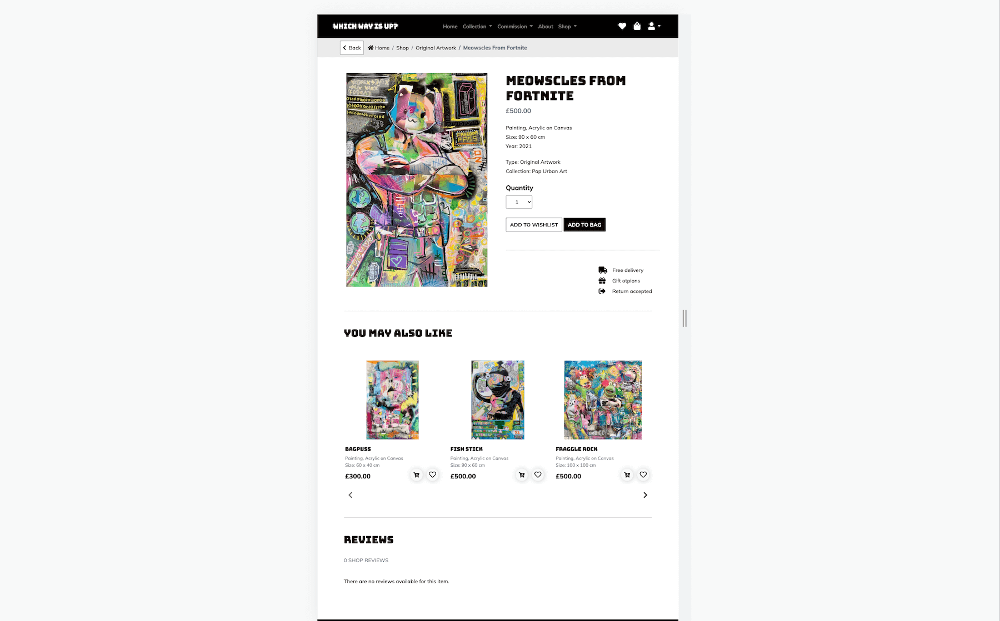

   Commission artworks will feature a button inviting users to contact the shop owner should they want to commission the artist for a bespoke work. 
   
   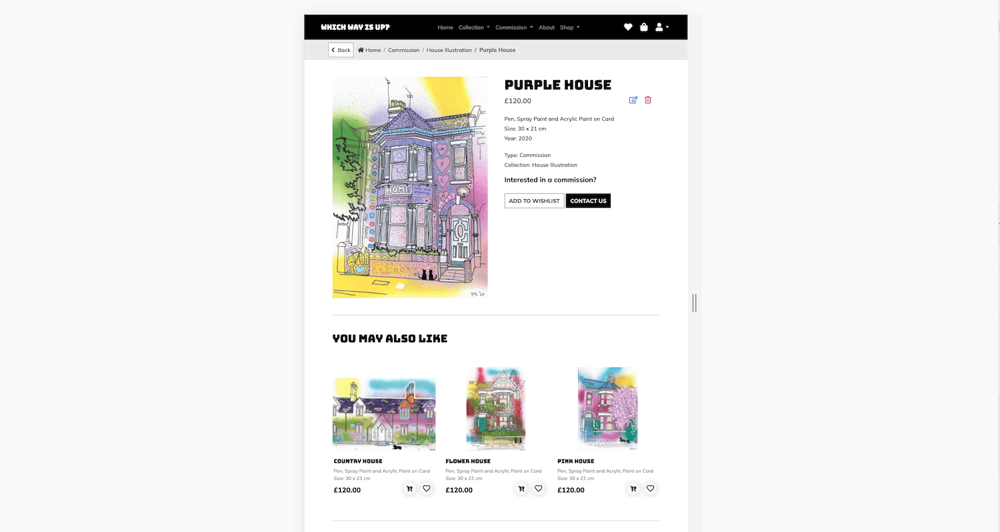

   Users are also able to add any artworks - wether available in the shop or not - to their wishlist for future reference. 
   
   The artwork detail page also feature breadcrumbs at the top of the page, indicating the current page's location within the navigational hierarchy, to allow users to return to the previous page or to navigate to higher level menu items.

   This page also includes an edit and delete button, only accessible to the shop owner, to easily manage the artwork catalogue.
   
    - ### **User stories** 
      > - As a site user, I want to see the details for an artwork so that I can get a better appreciation and decide if I would want to buy it.
      > - As a shopper, I want to view related items so that I can purchase several artwork
      > - As a shopper, I want to view the artwork price and details so that I can make an informed decision
      > - As a shopper, I want to select quantity of an item if applicable so I can order what I need
      > - As a shopper, I want to read reviews so that I can have a better understanding of the quality of the artist work

 
 - ## **Shop**
 
   The shop will display all the artwork available for sale by displaying artwork images, title and pricing information. The user will be able to select categories of their choosing to browse artwork specific to their interest. The user will also be able to sort shop items by alphabetical order, pricing and collection in alphabetical order.
   
   Once the user click on an item name, they will be redirected to the artwork detail page where all the information related to the artwork will be displayed. 
   
   From the shop pages, users will also be able to add an item to their shopping cart  and / or their wislist. Items added to users' wishlist will be displayed with a red heart icon (if user is logged in)
   
   Sale items will have their price striked through and a sale price will be displayed in red. A red label will also feature on the image.
   
   Out of stock items will feature an out of stock label and the add to cart button will be disabled.
   
   These pages also include an edit and delete button for each items, only accessible to the shop owner, to easily manage the artwork catalogue.

   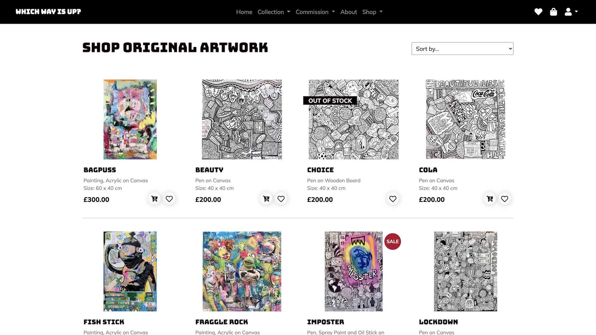
   
   - ### **User stories**
     > - As a shopper, I want to view all the artwork available so that I can quickly have an overview of what is on offer
     > - As a shopper, I want to view available artwork by specific collection and category so that I can quickly find products I’m interested in.
     > - As a shopper, I want to sort the list of artwork available so that I can find a piece in my price range

 - ## **Shopping bag**
   
   The shopping bag features a summary list all the items added by the user, including a small thumbnail, quantity and prices as well as an order summary. The user will be able to:
   - Adjust quantities for each item in the shopping bag
   - Add / remove items to / from users' wishlist
   - Remove an item from their shopping bag by clicking on the 'remove item' link.
   - Add a gift option and message 
   
   When adjusting / removing an item in/from the shopping bag, the totals and subtotals will adjust accordingly and a toast message will inform the user about their action and the content of the shopping bag. 

   The site owner has decided that he will not apply delivery charges and the delivery charges will be displayed as "Free". The shopping bag a also features a button "Continue shopping" to allow users to go back to the shop to browse / purchase further items. 
   
   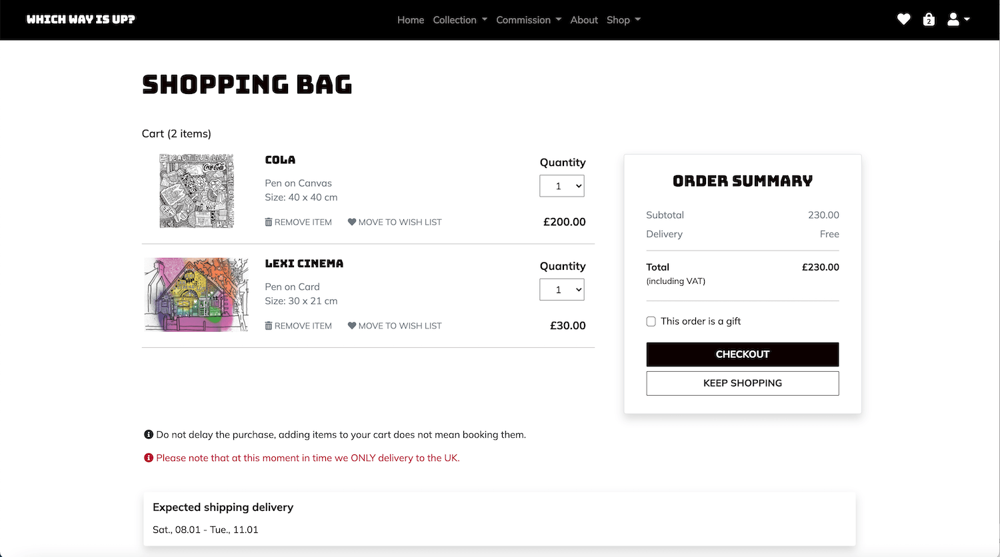
   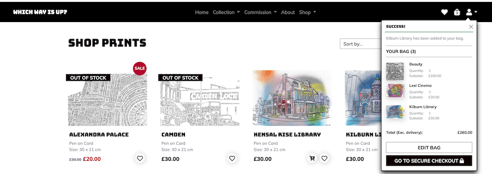

   - ### **User stories** 
     > - As a shopper, I want to review items in my shopping bag so that I can adjust quantities ordered.

 
 - ## **Checkout**
 
   The checkout page features a checkout form and an order summary with all the items in the shopping bag, including a thumbnail, artwork title, quantity as well as subtotals and totals. 
   
   Users - if not registered / signed-in - will be required to complete their personal details and delivery address for the items to be sent to, with the possibility to save these details by signing in or regsitering on the website. If users are logged-in, these fields will be pre-populated and users will be able to update their details.
   
   The checkout form offers users the possbility to select a gift option and have the items sent to a different delivery address with a gift message. 
   
   The checkout form includes a payment section where users are required to fill their card details with secure paiement handled by Braintree. 
   
   At any stage of the process users will be able to go back to the shopping bag for further adjustement. 
   
   When all the information are complete, users will be able to place the order and paiement will be processed. A notification be will displayed at the top of the page to inform the user that the order has been processed successfully / or of any errors happening during the checkout process. 
   
   If the order is successful, users will be redirected to an order confirmation page.

   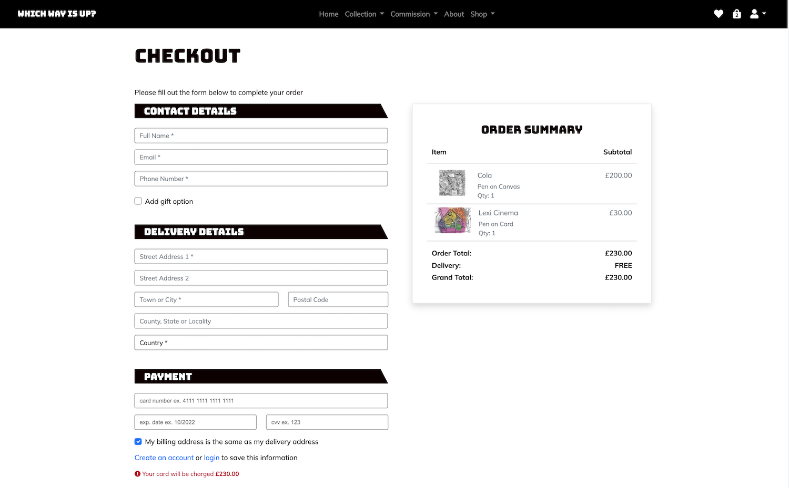

   - ### **User stories**
     > - As a shopper, I want to have a gift option so I can buy a print / piece of art for a special occasion for a friend
     > - As a shopper, I want to enter payment information in a safe and secure way so that I can checkout quickly with confidence

 - ## **Order confirmation**
   
   Once users have placed an order successfully, they will be redirected to an order confirmation page that displays summary of the order, contact details and delivery information provided. Users will also be sent a confirmation email with details for their order.

   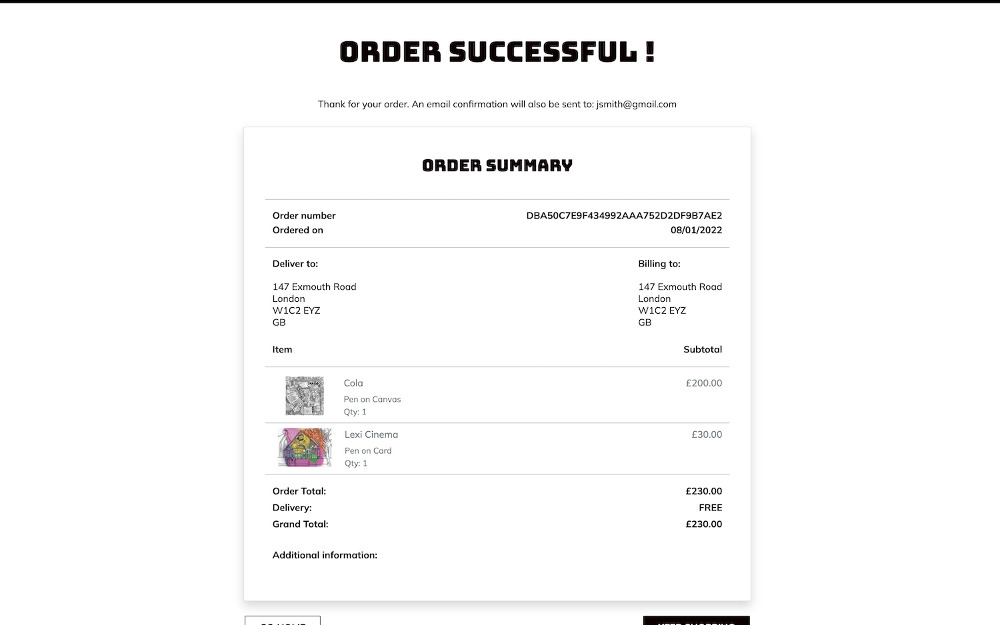
   
   - ### **User stories**
     > - As a shopper, I want to receive confirmation of my order so that I can have a proof of purchase

 
 - ## **Login page**
   
   The login page features a form asking users for their email and password. The password can be made visible by toggling the eye icon. The login page also features a link allowing users to reset their password.

   Upon successfully login, a notification will display at the top of the page and users will have access to all the features of the website such as profile page, saved items as well as adding/editing reviews. The navigation bar will update with additional menu items so that users can access all the features available to them.
   
   Once signed in, the shop owner will be able to add, edit and delete collections, artworks and events

   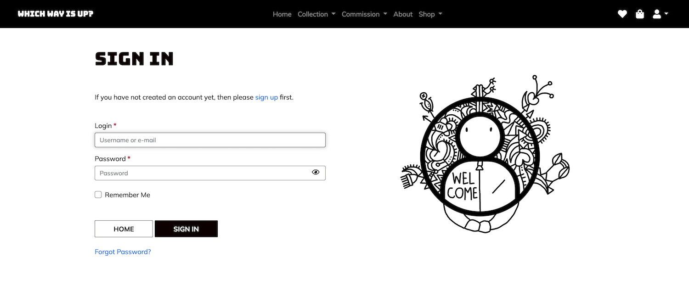

   - ### **User stories**
     > - As a site user, I want to login and logout so that I can access my profile safely 
     > - As a site user, I want to reset my password if I forgot it so that I can access my account

 
 - ## **Signup page**
   
   The sign up page features a form asking users for heir email address, username and password. Once submitted users will be asked to confirm their email address to complete the registration process. Users will also be able to navigate to the login page, if they already have an account.
   
   Upon successfully registration to the website, users will be informed via a toast message displayed a the top of the page.

   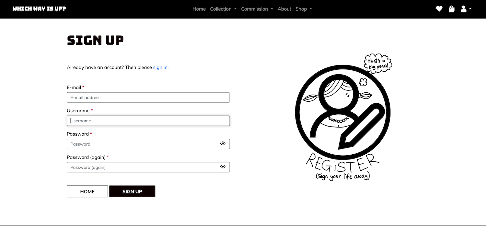
   
   - ### **User stories**
     > - As a site user, I want to register for an account so that I can view my orders and my favourite items.

 - ## **Profile page**
   
   The profile page features the personal details of the user and is only accessible once the user has logged-in onto the website. Users will be able to update their profile.
   
   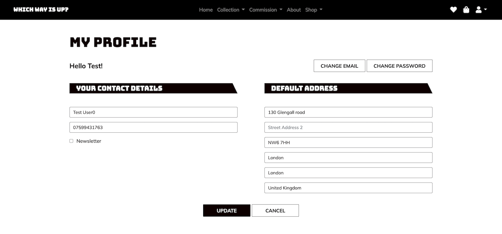

   - ### **User stories**
     > - As a site user, I want to edit my profile so that I can update my personal information
     > - As a site user, I want to delete my profile so that my personal information are removed from the website

 - ## **My orders**
   
   My order page features users' order history and is only accessible once the users have logged-in onto the website. The user will be able to review past orders and view order details by clicking on the order reference number. From this page, users will be able to leave reviews for items they have ordered.
   
   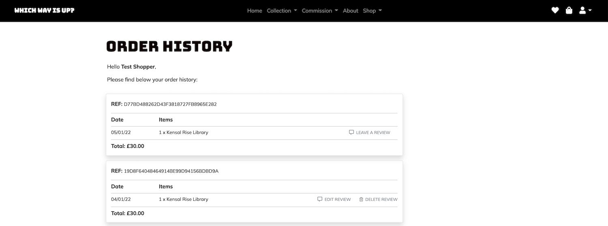

   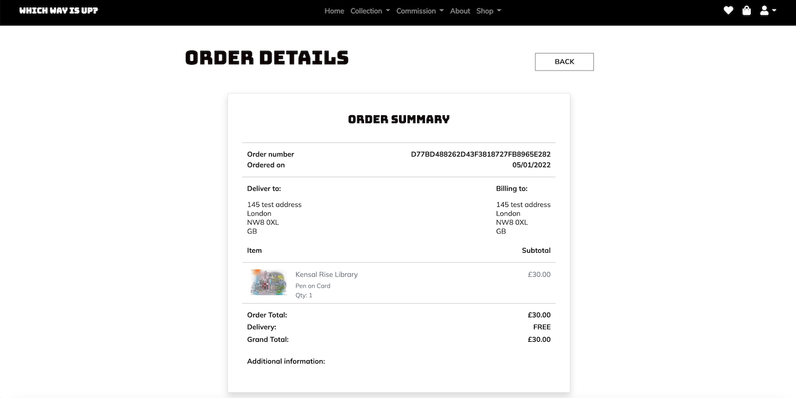

   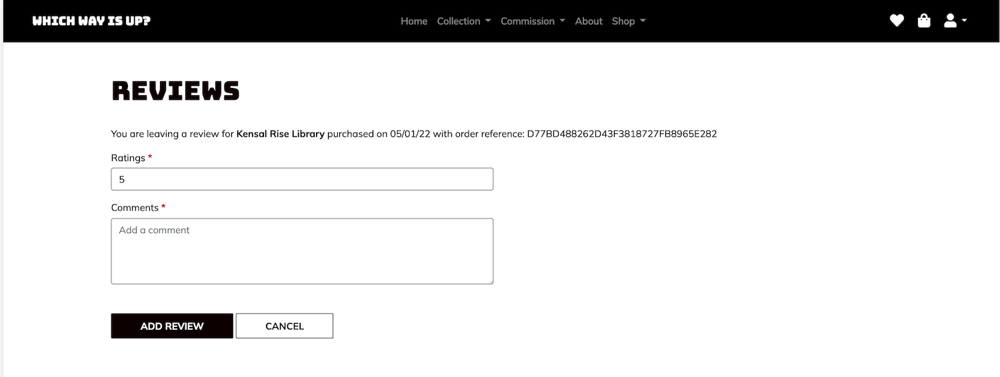

 - ## **My reviews**
   
   'My reviews' page features reviews left by the user and is only accessible once the user has logged-in onto the website. The user will be able to update / delete their reviews.

   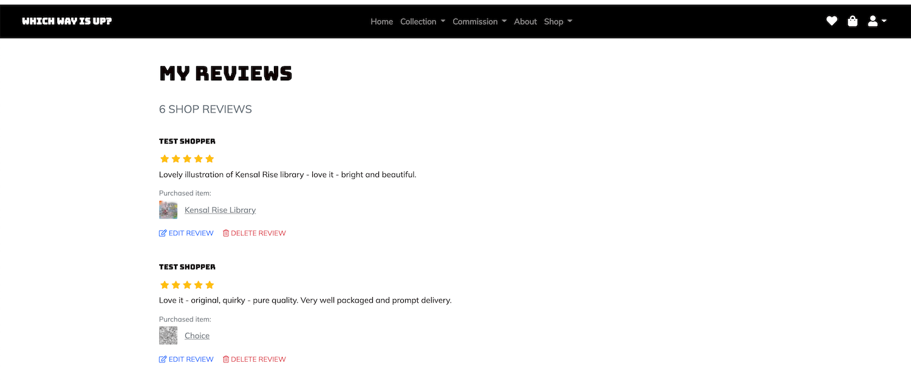
   
   - ### **User stories**
     > - As a site user, I want to leave a review so that I can let others know about my shopping experience

 - ## **Review page**
   
   The review page features a list of all the reviews left by users on items they have purchased to allow visitors to have a shared understanding of other user experience of the website and artist's work.

   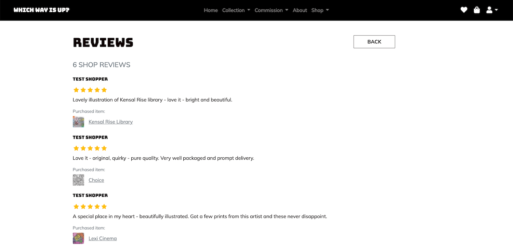
   
   - ### **User stories**
     > - As a shopper, I want to read reviews so that I can have a better understanding of the quality of the artist work

 - ## **Wishlist**
   
   The wishlist page features all the artwork saved by the user and is only accessible once the user is signed in. The user will be able to remove items from their wishlist or add the artwork to their shopping bag. 

   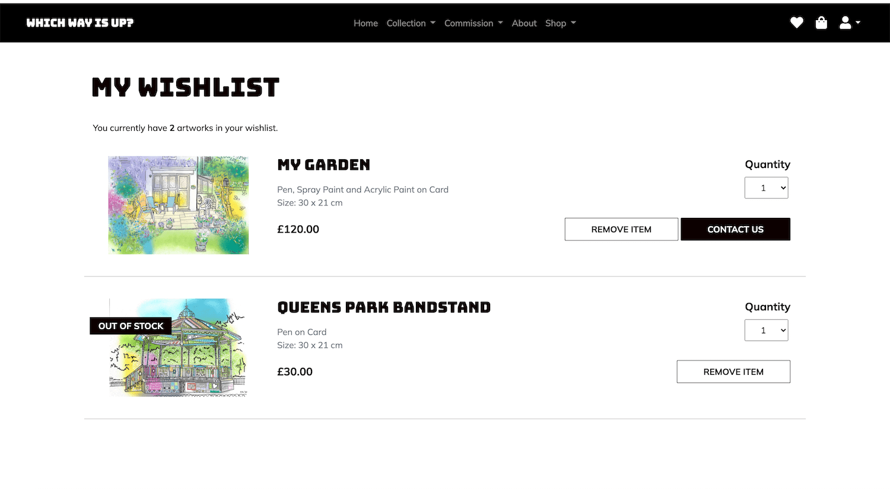
   
   - ### **User stories**
     > - As a site user, I want to save artwork as my favourites so that I can buy it later or buy it again

 - ## **Add a collection page**
  
   The "Add a collection page" is only available to the site owner once logged-in and features a form to add a collection to the website. The shop owner will be able to add a title, an image and a description for a collection. 
   
   Furthermore, the site owner can opt:
   - to display the collection on the website or not by selecting the status active / inactive.
   - to display the collection on the homepage (any other collection will be removed from the homepage upon adding the collection)
   
   According the category selected, the portfolio will either be added to the dropdown menu under collection/commission or any other relevant categories if any others have been added. 

   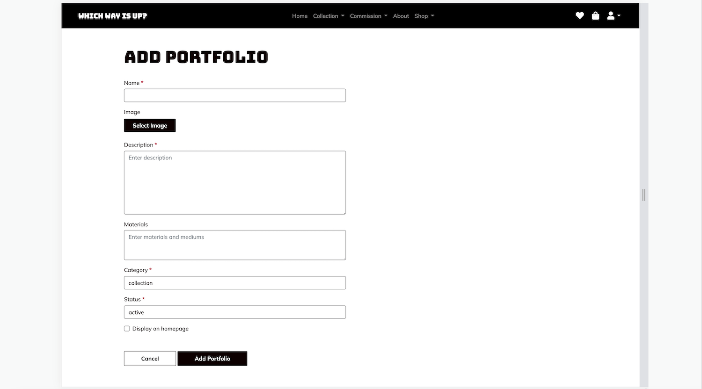
  
   - ### **User stories**
     > - As the site owner, I want to add, edit and delete a collection so that I can keep my portfolio and work up-to-date
     > - As a site owner, I want to be able to edit most of the content of the website, so that I can keep my website up to date and engaging.

 - ## **Add an item page**
  
   The "Add an item page" is only available to the site owner once logged-in and features a form to add an artwork to the shop and/or attach an artwork to a collection.
   
   The site owner will be able to add an image, a title, a description, as well as stock, size and pricing information. Additional features allow the site owner to select related items, whether to display the artwork in the shop or not.

   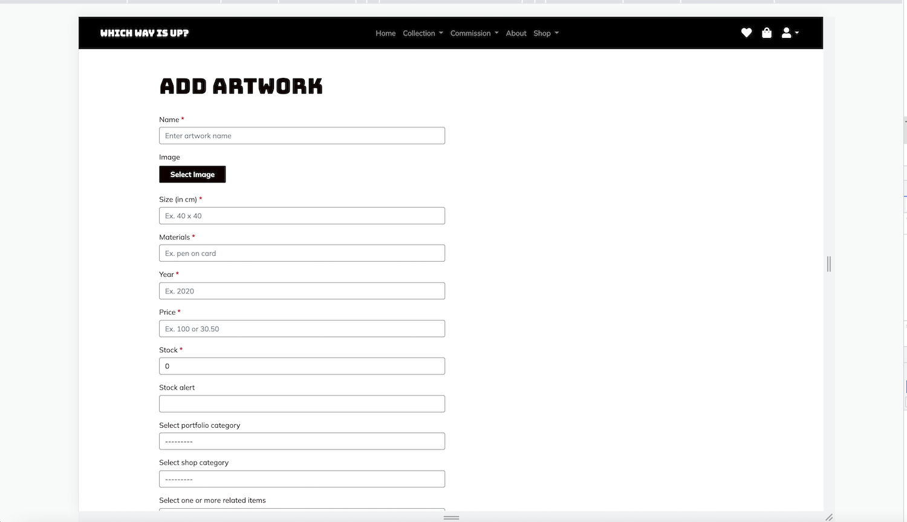

   - ### **User stories**
     > - As the site owner, I want to add, edit and delete individual artwork and items to that I can link them to collection and keep my shop up-to-date
     > - As a site owner I want to add related product so that I can encourage multi-buy.

- ## **Policy pages**

    The policy pages inform users about the delivery, terms and conditions as well as privacy and accessibility. 

    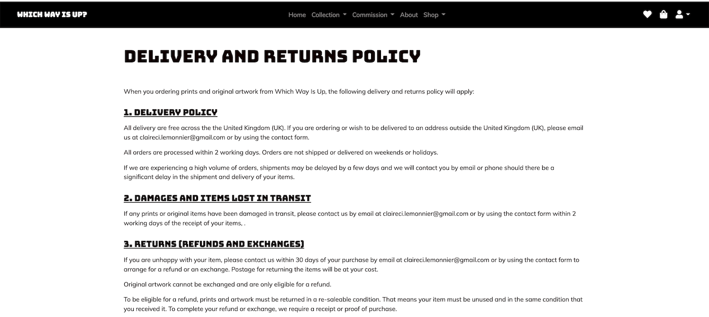

- ## **Error pages**

   Error pages inform users about the type of error that have occured such as:
   - Page not found 
   - Internal server error
   - Access denied

   These pages will redirect users to the homepage.

   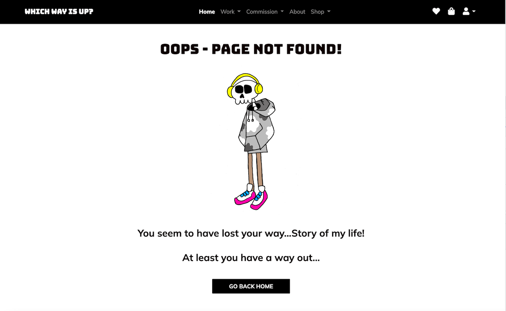

- ## **Notifications and messages**

  - ### **Notifications**

    The following toast notifications are used throughout the website to provide users with feedback on actions carried out as follows:

    - Success messages:
      - Signing up sucessfully
      - Signin in and out
      - Adding artwork to shoppping bag
      - Updating quantities in shopping bag
      - Successfully completing an order
      - Sucessfully completing the contact form
      - Succesfully adding, updating or deleting artworks, portoflio and profiles information
      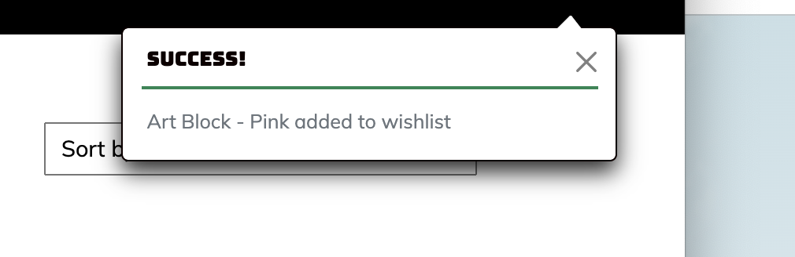

    - Errors
      - User trying to add/edit/delete a portfolio, an artwork or an event and is not a superuser
      - User has not got permission to add a review on an item which was not purchased by them
      - When user tries to add a review and has already submitted a review
      - When forms are not valid when adding/updating/deleting a portfolio, artwork, event as well an order and a review
      - When user tries to place an order and the shopping bag is empty
      - When user tries to place an order with an address outside the UK
      - When an item has become unavailable in the shopping bag
      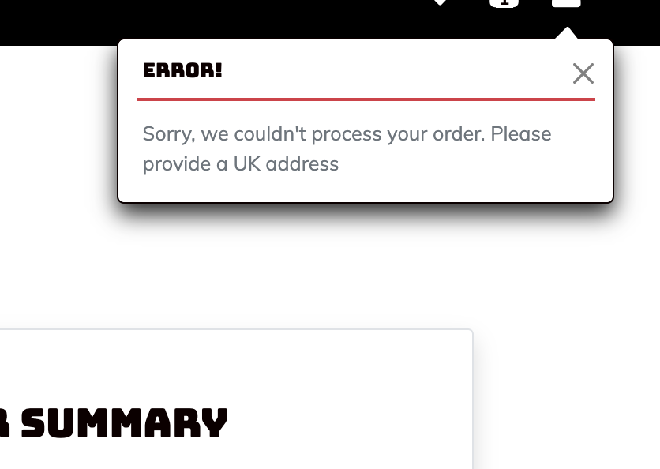

    - Information
      - Adding or editing a portfolio, an artwork or an event
      - Completing the checkout to remind users to use a UK address
      - Trying to delete items with orders attached to them and items have been set as inactive instead.
      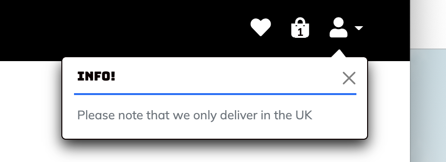

    - Warnings
      - User has already subscribed to newletter

  - ### **Messages**

    User will receive emails when:
      - Signing up for an account to verify their email 
      - Resetting their passwords 
      - Placing an order with an order confirmation
      - Items in users' wishlist that have been removed
      - Contacting the shop owner using the contact form
      - Signing up for the newsletter

    In addition the shop owner will receive an email when:
      - A user contacts the shop owner with the user's query, full name and email address
      - Stock level reaches alert level with a reminder to replenish the stock
