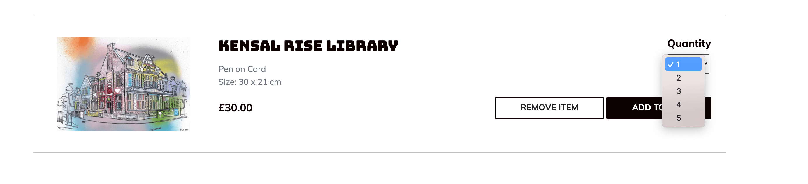
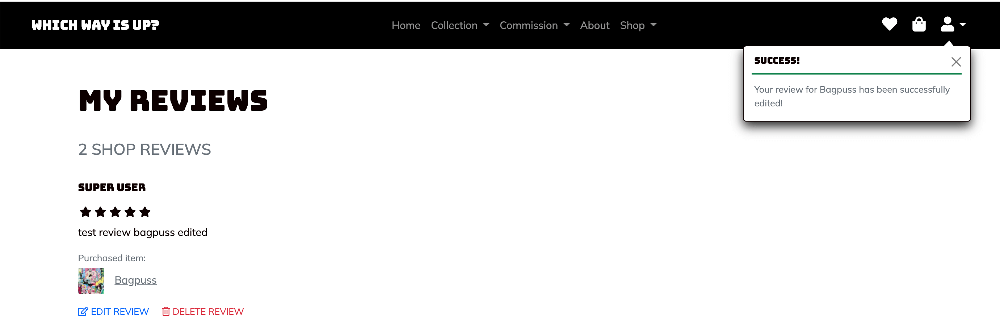
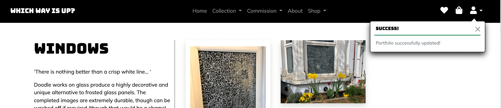
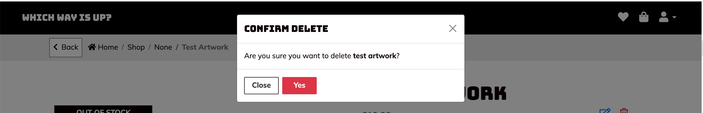
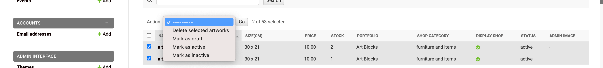

 # TESTING USER STORIES
  
  [Return to main ReadMe](/README.md#testing)
  
  - ## **Navigation and website experience**
  
    - ### **As a site user, I want a responsive website so that I can access it on different devices.**
      - When I visit the website using my device, the content is optimized for that device
      - On a mobile and tablet the navigation bar is collapsed
      - When the navigation is collapsed, a toggle button is displayed to the left of the header, and
      - When I click on the toggle button, a vertical menu is displayed,
      - When I click again on the toggle button, the vertical menu collapses back.
      - **Result**: Pass ✅
      
      **Example responsive screen**
      

      **Mobile navbar**
      

      **Ipad navbar**
      

    - ### **As a site user, I want to easily navigate across the site so that I can find the information I need.**
      - When I hover on a menu item in the top navigation bar, its appearance changes.
      - When I click on a menu item in the navigation bar, the relevant page is displayed without errors.
      - When I click on any link in the footer, the relevant page is displayed without errors.
      - **Result**: Pass ✅

      **Desktop navbar**
      

    - ### **As a site user, I want to read about the artist so that I can learn about artist background and exhibitions**
      - When I click on the "about" menu item in the top navigation bar, the "about me" page is displayed with
      - an image of the artist,
      - a biography about the artist and,
      - a list of exhibitions and events displayed in inverse chronological order with latest events appearing first.
      - **Result**: Pass ✅

      **Artist biography**
      

      **Events section**
      
      
    - ### **As a site user, I want to view the artist work so that can understand his work**
        - When I click on the menu item "work", a secondary drop down menu is displayed with the name of the artist work (collection) and,
        - When I click on a collection, I am redirected to the relevant page where information and an image library are displayed,
        - When I hover an image in the library, an overlay features a series of three buttons as follows:
          - A magnifying glass button
          - An information button
          - A button with an heart icon
        - When I click on the button with the magnifying glass icon, a modal window opens with a zoom image of the artwork
        - When I click on the button with the information icon, I am redirected to the product page
        - When I click on the button with the heart icon and if I am authenticated the artwork is added to my wishlist and the appearance of the icon changes to red.
        - When I click on the button with the heart icon and I am not authenticated, an information message is displayed asking me to sign-in/register to access this feature.
        - **Result**: Pass ✅

      **Portfolio page with image library**
      

      **Overlay over artwork image with buttons**
      

      **Zoom modal**
      

      **Item added to wishlist**
      

    - ### **As a site user, I want to see the details for an artwork so that I can get a better appreciation and decide if I would want to buy it**
        - **Path 1**
            - When browsing a collection and when I click on the information button for an artwork or,
            - I am redirected to page where the details for this artwork is displayed, including an image, a title, as well as the size for this artwork, related artworks and reviews (if they're are any)
            - If the artwork is available for sale, its price will be displayed as well as a button to add to cart,
            - If the artwork is not available for sale, a button inviting to contact the artist is displayed.
            - **Result**: Pass  ✅

        - **Path 2**
            - When I browse the shop and when I click on the name of an artwork, 
            - I am redirected to a page where the details for this artwork is displayed, including an image, a title, the size for this artwork, its price as well as related artworks and reviews (if they're are any) and,
            - A button to add to cart is also displayed
            - **Result**: Pass  ✅

        **Example of product page with add to cart button**
        

        **Example of product page with contact us button**
        

    - ### **As site user, I want to engage with the artist work so that I can be part of the artist community**
        - When I browse down the homepage, a section with downloadable colouring page is displayed as well as a hashtag encouraging me to share my colouring work with the artist on social media,
        - When I click on the image, the content is downloaded on my device where I should be able to open the colouring sheet in pdf format and print it
        - **Result**: Pass ✅

        **Homepage colouring section**
        

 - ## **Shopping experience** 
 
    - ### **As a shopper, I want to view all the artwork available so that I can quickly have an overview of what is on offer**
      - When I select "all" from the shop in the top navigation bar, I can see all the avaialbe artworks in the shop with an image, a title and a price being displayed, as well as items out of stock and items for sales
      - When I hover the artwork name, the text is underlined and when I click on the link I am redirected the artwork detailed page
      - When I click on the "shopping bag" button, the artwork is added to my shopping bag and a toast message is displayed with a summary of my shopping bag
      - When I click on the button with a heart icon and I am logged in, the artwork will be added to my wishlist but,
      - If i click on the button with heart icon and I am not authenticated, a toast message will invite me to either login or register.
      - **Result**: Pass ✅

      **Shop all page**
      

      **Info message when user tries to add item to wishlist and not authenticated**
      

    - ### **As a shopper, I want to view available artwork by specific category so that I can quickly find products I’m interested in.**
        - When in the navigation bar, I can select a category of artwork, 
        - When I select a category, the artwork related to that category is displayed
        - **Result**: Pass ✅

      **Shop navigation bar**
      

      **Shop page example**
      

    - ### **As a shopper, I want to sort the list of artwork available by price so that I can find a piece in my price range**
      - When I am browsing the shop - I can see a "sort by" select field, where I can sort items by price or alphabetical order,
      - When I click on sort by price low to high, the page refresh with all the artwork arranged in pricing order from the lowest to the highest,
      - When I click on sort price high to low, the page refreshes will all the artwork arranged in pricing order from the highest to lowest
      - **Result**: Pass ✅

      **Sort filter options**
      

      **Sort result display**
      

    - ### **As a shopper, I want to view the artwork price and details so that I can make an informed decision**
      - When I browse the shop - either viewing all items or specific category of items and,
      - I can see the image, the artwork title and price and,
      - When I hover the artwork name, its appearance changes and,
      - When I click on the artwork, I am redirected the artwork detail page where all the details for the artwork is displayed including its price.
      - **Result**: Pass  ✅

    - ### **As a shopper, I want to read reviews so that I can have a better understanding of the quality of the artist work**
      - **Path 1**:
        - When I browse down the homepage, I can see a section with some reviews and button to see more reviews,
        - When I click on the button "more reviews, I am redirected to a page with all the reviews
        - **Result**: Pass ✅

        

        

      - **Path 2**:
        - When I browse an artwork details, I can see a section at the bottom of the page with product reviews.
        - **Result**: Pass ✅
        
        **Product page review section**
        

    - ### **As a shopper, I want to view related items so that I can purchase several artwork**
        - When I browse an artwork detail page, a section named "You may also like" is displayed with an image, name and pricing information for each related item, 
        - When I click on a related artwork, I am redirected to the relevant detail page for this artwork.
        - **Result**: Pass ✅

        **Related items**
        
  
    - ### **As a shopper, I want to select quantity of an item if applicable so I can order what I need**
        - When I browse an artwork detail page and / or my wishlist and, 
        - If the artwork is available to purchase in multiple quantity, 
        - A select field with a label "quantity" is displayed and, 
        - When I click on the select field, the list of available quantities is displayed
        - When I select a quantity in the select field and click on add to bag, the right quantity for the relevant artwork is added to the shopping bag and a notification message is displayed.
        - **Result**: Pass ✅

        **Quantity available is one**
        

        **Quantity availabel is more than one**
        

        **Add to bag success message and bag summary**
        

- ## **Shopping bag and checkout**

    - ### **As a shopper, I want to review items in my shopping bag so that I can adjust quantities ordered**
      - When I browse my shopping bag, I can see a list of items in my bag with a thumbnail, title, quantity and subtotals for each items,
      - When I click on the select field and update the quantity, the subtotals and totals adjust accordingly
      - When I click on the "remove item" link, the item is removed from my shopping bag with the subtotals and totals adjusting accordingly
      - When I click on the "move to wishlist" link and if I am authenticated, the artwork will be added to my wishlist and a success message will be displayed
      - When I click on "move to wishlist" and I am not authenticated, a message will display inviting me to either login or register
      - When I click on on the button "Continue Shopping", I am redirected to the previous shopping page
      - When I click on checkout, I am redirected to the checkout page
      - **Result**: Pass  ✅

      **Update quantity**
      

      **Remove items**
      

      **Add item to wishlist from shopping bag and user is not registered**
      

      **Defensive design: Attempting to remove item not in the list**
      

    - ### **As a shopper, I want to have a gift option so I can buy a print / piece of art for a special occasion for a friend**
      - **Path 1**
        - When on the shopping bag and /or checkout page,
        - I can see a checkbox entitled "gift option",
        - When I check "gift option", additional fields are displayed such as the name of the recipient and a message to be sent alongside the item
        - **Result**: Pass  ✅
      
      - **Path 2**
        - When the shopping bag page and I have already filled the gift option information and,
        - When I go the checkout page, the information I've completed are there and,
        - I just need to complete the recipient name
        - **Result**: Pass  ✅

      **Gift option on shopping bag page**
      

      **Gift option on checkout page**
      

    - ### **As a shopper, I want to enter payment information in a safe and secure way so that I can checkout quickly with confidence**
      - When landing on the checkout page, I can see a toast message informing me that the shop delivers to the UK only and
      - If I am logged in, the form is prefilled with my information,
      - When on the checkout page, I can see a paiement details section at the bottom of the page with field asking me for my debit/credit card details, expiry date and CVC
      - When I complete these details correctly and click "checkout" I am redirected to an order confirmation page and I also can see a notification informing me of my successful order.
      - When I complete these details incorrectly and click "checkout", an error message will display prompting me to enter the correct information.
      - **Result**: Pass  ✅

      **Checkout prefilled with authenticated user information**
      

      **Checkout form with missing information**
      

      **Checkout form invalid paiement form**
      

      **Checkout form valid paiement form**
      

    - ### **As a shopper, I want to receive confirmation for my order so that I can have a proof of purchase**
      - When I place a successfuly order, I am redirected to an order confirmation page with the details for my order, my details as well as delivery information. 
      - I should also receive an email with my order details with the same information as on the order confirmation page.
      - **Result**: Pass  ✅

      
 
- ## **Registration and account management** 

    - ### **As a site user, I want to register for an account so that I can view my orders and my favourite items** 

        - **Navigation**
            - When I click on the "user" icon, a dropdown menu is displayed with the options to login and to register,
            - When I click on the secondary menu item "Register", a form is displayed prompting me to complete my email, a username and a password.
            - **Result**: Pass ✅

            

        - **Form valid path**
            - when I enter my email in the "email” field and
            - When I enter my username in the “username” field and,
            - When I enter a valid password including a mix of letters, numbers and symbols,
            - A message informing me to verify my email address is displayed.
            - I should have also received an email with a link to confirm my email 
            - When I click on the link in the email, I am redirecting to a page asking me to confirm my email
            - When I click on the button "confirm email", I am redirected to the login page and a toast message is displayed to inform me that my email has been successfully verified.
            - **Result**: Pass ✅
          
          **Verify email address**
          

          **Confirm email address**
          

          **Email address verified**
          

        - **Form invalid path**
            - When I enter invalid email in the “email” field and or leave the field empty, and/or
            - when I enter an invalid username address in the “username” field or leave the field empty and if
            - When I enter an invalid password or leave the password field empty,
            - Errors messages will display and I will be prompted to enter valid information
            - **Result**: Pass ✅
          
          

        - **Invalid path: existing user**
            - When I enter credentials for a user that already exists, 
            - An error message will display to inform me that a user already exists with these credentials and inviting me to log in instead. 
            - **Result**: Pass ✅
            

    - ### **As a site user, I want to login and logout so that I can access my profile safely**
        - **Navigation**
            - When I click on the "user" icon, a dropdown menu is displayed with the options to login and to register,
            - When I click on the secondary menu item "Login", a form is displayed prompting me to complete my email and a passwork.
            - **Result**: Pass ✅

            

        - **Form valid path**
            - When I enter my email/username in the “login” field and
            - When I enter my password in the “password” field and,
            - If the information match my account, a success message is displayed informing me that I have successfully logged in.
            - **Result**:  Pass ✅

            

        - **Form invalid path: Incorrect credentials**
            - If I enter the wrong password/email/username, a message will display to inform me that my credentials are incorrect, 
            - **Result**: Pass  ✅

            

        - **Form invalid path: invalid input**
            - If I enter invalid email/username in the “login” field or leave the field empty, and/or
            - If I leave the passwword field empty,
            - A message will display and I will be prompted to fill valid information and
            - **Result**: Pass  ✅

            
  
    - ### **As a site user, I want to edit my profile so that I can update my personal information**
        - **Navigation**
            - When I have successfully logged in and,
            - When I click on the user icon, a dropdown menu is displayed,
            - When I click on my profile, I am redirected to my profile page with the details I've already entered displayed in a a form
            - **Result**: Pass  ✅

        

       - **Edit profile - valid path**
            - When I edit a field in my personal information in the valid format and click on "update my profile", 
            - My profile is updated and a message informing me that my profile has been successfully updated is displayed.
            - **Results**: Pass  ✅
        
        
           
    - ### **As a site user, I want to reset my password if I forgot it so that I can access my account**
        - **Navigation**
           - When I am the login page, I can see a link "reset your password" and,
           - When I click on the link "reset my password", I am redirected to a page asking me for an email address with a button to reset my password
           - **Result**: Pass ✅
        
        

        - **Valid path**
            - When I enter a valid address and I click the button "reset my password", I should receive an email with a link redirecting me to a form to edit my password. 
            - When I enter a new password, my credentials are updated. 
            - **Result**: Pass ✅
        
          

        - **Invalid path**
            - When I leave the email field empty / input an invalid email address, I am prompted to enter valid information
            - When I enter an incorrect email address, a message is displayed informing me that the e-mail address is not assigned to any user account.
            - **Result**: Pass ✅
        

- ## **Wishlist items, product review and order details**

    - ### **As a site user, I want to save artworks in my wishlist so that I can buy it later or buy it again**

      - **Path 1: accessing wishlist - authenticated users**
        - When I hover over the "heart" icon in the navigation, its appearance changes and, 
        - When I click on the icon and if I am logged-in, I am redirected to "My wishlist" page and,
        - A list of artwork added as my favourite is displayed with buttons to either add the artwork to the shopping cart or remove the the artwork from my saved items.
        - If I don't have any items in my wishlist, a paragraph will be displayed instead saying that "there is no items in my wishlist"
        - **Result**: Pass ✅

        **Whishlist page**
        

      - **Path 2: removing items from wishlist**
        - When I click on the button "Remove", the artwork is removed from my saved items and a message informing me that the item has been successfully removed is displayed.
        - **Result**: Pass ✅

        **Whislist remove success**
        

      - **Path 3: adding artwork to shopping cart**
        - When I click on the select field quantity, a dropdown with option to select from available quantities is displayed
        - When I click on the button "Add to cart", the artwork is added to my shopping bag with the selected quantity and a message informing me that the item has been successfully added to my shopping bag is displayed.
        - **Result**: Pass ✅

        **Wishlist add to shopping cart**
        
        

      - **Path 4: wihslist page and non authenticated users**
        - When I click on the icon and if I am not logged in, I am redirected to the "login page"
         - **Result**: Pass ✅

    - ### **As a site user, I want to view my orders**
      - When I have successfully logged in and,
      - When I click on the user icon, a dropdown menu is displayed,
      - When I click on my orders, I am redirected to 'my orders' page displaying details of past orders in reverse chronological order,
      - When I hover over one of the order reference number, its appearance changes and 
      - When I click on one of the reference number, I am redirected to the order detail page
      - **Result**: Pass ✅

      **My orders page**
      

      **Order detail page**
      

    - ### **As a site user, I want to leave a review so that I can let others know about my shopping experience**

      - **Path 1 - artwork page**
        - When I browse the page for the artwork that I have purchased and I haven't yet left a review, I can see a link "leave a review" at the bottom of the page
        - When I click on "leave a review",  I am redirected to a page with a form where I can select a rating in the "rating" field and enter a comment in the "comment" field,
        - When I click "Submit" and that my form is valid, the review is displayed under the artwork I purchased and notification informing me that I have successfully left a review is displayed
        - When I click on "Submit" and my form is not valid, an error message will be displayed prompting me to fill the form with the valid information.
        - Additional links will display under my review, so that I can edit / delete my review.
        - **Result**: Pass ✅

        **Artwork page review section**
        

        **Add a review page**
        

        **Add a review invalid input**
        

        **Add a review success message**
        

      - **Path 2 - my order page**
        - When I am logged in and that I browse my order history,
        - For each item I have ordered but I haven't left a review, a link to 'add a review' is displayed
        - A page opens with a form where I can select a rating in the "rating" field and enter a comment in the "comment" field,
        - When I submit the review and if my form is valid, I am redirected to the "Order history page"
        - When I submit the review and if my form is not valid, an error message will display asking me to fill the form with valid information.
        - **Result**: Pass ✅

        

      - **Path 3 - My reviews page**
        - When I am logged in and when I click on the user icon, a dropdown menu is displayed,
        - When I click on "My reviews" a page opens with all the reviews that I have created and,
        - For each review, a link to "edit my review" and a link to "delete my review" are displayed
        - **Result**: Pass ✅

        

      - **Path4 - Editing my reviews**
        - When on my order pages, my reviews page or the artwork detail page, I can see a link to edit each of the reviews that I have created
        - When I click on edit, a page opens with a form prefilled with my reviews details and I am able to edit my reviews,
        - When I click submit and if the form is valid, my review is edited and a notification that my review has been successfully edited is displayed
        - When I click submit and the form is invalid, an error message will be displayed asking me to complete the form with valid information.
        - **Result**: Pass ✅
        
        **Edit review**
        
      
        **Toast message - review successfully edited**
        

      - **Path5 - Deleting my reviews**
        - When on my order page, my reviews page or the artwork detail page, I can see a link to delete each of the reviews that I have created
        - When I click on delete, a modal page opens asking me to confirm whether I wish to delete my review.
        - When I click on yes, my review is deleted and a toast message confirming that my reviews has been successfully deleted is displayed.
        - **Result**: Pass ✅
      
        **Delete a review modal**
        

        **Delete a review - success message**
        

- ## **Contact and connect**

    - ### **As a site user, I want to contact the site owner so that I can make queries about his work / request for a commission**
    
      - #### **Navigation**
        - When I scroll down to the footer, I can see a the white button "contact",
        - When I hover over the contact button, its appearance changes and,
        - When I click on the contact button, I am redirected to a contact page which features a contact form.
        - **Result**: Pass ✅

        

        

      - #### **Authenticated user**
        - When I am logged in, I can see that the contact form is prefilled with my details
        - **Result**: Pass ✅
      
      

      - #### **Valid path**
        - When I enter all the valid information, including my full name, my email address and a query message, and
        - I click on submit,
        - The page refresh with a message informing me that my message has been sent successfully.
        - Once I have contacted the owner, I should receive an acknowlegment email.
        - **Result**: Pass ✅

        

      - #### **Invalid path**
        - If I leave or enter an invalid information in any of the fields, I will be prompted to fill or to enter valid information.
        - **Result**: Pass ✅

        

        
   
    - ### **As a site user, I want to follow the artist on social media so that I can keep up to date with his work**
      - When I scroll down to the footer, I can see three social media icons for Instagram, Facebook and Twitter,
      - When I hover over any of these icons, their appearance changes
      - When I click on any of these icons, I am redirected to the relevant social media platform in a new tab.
      - **Result**: Pass ✅

      

- ## **Admin and site management**

    - ### **As the site owner, I want to add, edit and delete a collection so that I can keep my portfolio and work up-to-date**

      - **Path: Add a collection**
        - When I successfully log-in as the site owner, I can see a menu item entitled "Add Collection" in the top navigation bar under the user icon
        - When I click on the menu item "Add Collection", a page opens with a form to add collection details 
        - When I fill all the information correctly, the collection is successfully created and a notification is displayed.
        - Wen I fill information incorrectly / do not complete all the required fields in the form, an error message will display prompting me to correct my entries before submitting the form again
        - **Result**: Pass ✅
      
        **Add a portfolio page**
        

        **Add a portfolio invalid input**
        

        **Add a portfolio - success message**
        

      - **Path: edit collection**
        - When I am logged in as the super user and that I browse a collection page, I can see an icon to edit and an icon to delete my portfolio
        - When I click on edit, I am redirected to a page with a form prefilled with the details for the collection being edited.
        - When I click on submit and that the form is valid, the portfolio detail page will display updated information and a toast message informing that the portfolio has been successfully edited is displayed. 
        - When I click on submit and that the form is not valid, error messages will be displayed informing to fill the right information.
        - **Result**: Pass ✅

        **Edit collection page**
        
        **Edit collecion - success message**
        

      - **Path: delete a collection**
        - When I click on the delete icon on the porfolio page (when I am logged in as a super user),
        - A modal window opens asking me to confirm whether I am sure that I want to delete this collection and,
        - When I press yes, the collection is successfully deleted and a toast message is displayed 
        - When I press close, the modal window closes and the collection is not deleted.
        - **Result**: Pass ✅

        **Delete a collection modal**
        

        **Delete a collection - confirmation message**
        
  
    - ### **As the site owner, I want to add, edit and delete individual artwork and items to that I can link them to collection and keep my shop up-to-date**

      - **Path 1: Add artwork**
        - When I successfully log-in as the site owner, I can see a menu item entitled "Add Artwork" in the top navigation bar under the user icon
        - When I click on the menu item "Add Artwork", a page opens with a form to add artwork details 
        - When I fill all the information correctly, the artwork is successfully created and a notification informing me that the artwork has been successfully created is displayed.
        - Wen I fill information incorrectly / do not complete all the required fields in the form, an error message will display prompting me to correct my entries before submitting the form again
        - **Result**: Pass ✅

        **Add artwork page**
        

        **Add artwork - invalid input**
        

        **Add artwork - success message**
        

      - **Path: edit artwork**
        - When I am logged in as the super user and that I browse the artwork page, I can see tow icons to edit and delete the artwork
        - When I click on edit, I am redirected to a page with a form prefilled with the details for the artwork being edited
        - An information message is also displayed to let me know which artwork I am currently editing
        - When I click on submit and that the form is valid, the artwork detail page will display updated information and a toast message informing that the artwork has been successfully edited is displayed. 
        - When I click on submit and that the form is not valid, error messages will be displayed informing to fill the right information.
        - **Result**: Pass ✅

        **Edit artwork page**
        

        **Edit artwork - success message**
        

      - **Path: delete an artwork**
        - When I click on the delete icon on the artwork page and I am logged in as the shop owner,
        - A modal window opens asking me to confirm whether I am sure that I want to delete this collection, and, 
        - When I press yes, the artwork is either:
        - successfully deleted if no order is attached to it and a success message is displayed to let me know that the artwork has been successfully deleted.
        - Set as inactive if there are orders attached it and an information message will be displayed to let me know that the artwork has been set as inactive.
        - When I press close, the modal window closes and the artwork is not deleted.
        - **Result**: Pass ✅

        **Delete a artwork modal**
        

        **Delete artwork - confirmation message**
        

        **Delete artwork - information message - set as inactive**
        

      - **Path : Setting artwork status from admin console**
        - When I am on the admin console under the artwork section, I can see a list of all the artwork I have created being displayed in a table.
        - When I click in the dropdown menu on top of the page, I can see the option to either delete the selected product, set the product as active, inactive or as draft.
        - When I select multiple artworks and that I click delete, if there are an order attached to that artwork, the artwork status will be set as inactive
        - When I select multiple artworks and I either select "set as active", "set as inactive" or "set at draft", the artwork status for each selected item will be updated accordingly.
        - When I select an item as inactive, it will be removed from users' wishlist and relevant users will receive an email to inform them that their items has been removed from their wishlist.
        - **Result**: Pass ✅

        

    - ### **As a site owner I want to add related product so that I can encourage multi-buy**
      - When I complete the form in "Add an Artwork" page, I can see an option to select related artwork from existing entries on the database.
      - When I select related artwork and submit the form, I can see under the artwork detail page related artwork displayed with a thumbnail, a title and price. 
      - **Result**: Pass ✅

      **Add related items in add or edit product page**
      

    - ### **As a site owner, I want to be able to edit most of the content of the website, so that I can keep my website up to date and engaging.**
      
      - ### **Add events**
        - From the dropdown menu under the user icon, I can see a link to add an event
        - When I click on add an event, I am redirected to a page with a form with dates, place and description,
        - When I complete the form in a valid format and click on submit, I am redirected to the "about page" where the event will be displayed and a toast message informing that I have succesfully created the event is displayed.
        - If the form is invalid, error messages will be displayed to let me know to complete required fields in a valid format.
        - **Result**: Pass ✅

        **Add event page**
        

        **Add event - invalid input**
        

        **Add event - success message**
        

      - ### **Edit/delete events**
        - When I am logged in as the shop owner and under the events section in the about page, I can see a link to "edit event" and a link to "delete event",
        - When I click on edit event, I am redirected to a page where all the details for my event are displayed for me to edit,
        - When I click on submit and that the form is valid, I am redirected to the about page and a toast message will be displayed to inform me that my event has been successfully edited.
        - When I click on submit and that the form is not valid, error messages will be displayed to let me know that I need complete the form in a valid format. 
        - **Result**: Pass ✅

        **Edit event page**
        

        **Edit event - success message**
        

      - ### **Deleting events**
        - Same as above,
        - When I click on the delete button, a modal window open asking me to confirm whether I want to delete this event,
        - When I click yes, the event is successfully deleted with a toast message being displayed.
        - **Result**: Pass ✅

        **Delete events modal**
        

        **Delete event success**
        

      - ### **Set featured portfolio for homepage**
        - When I add/edit a portfolio, I can select the boolean field "display home" and the portolio will be displayed on the homepage.
        - If any other portfolio in the database has a true value for "display home", it will be set as false
        - **Result**: Pass ✅

    - ### **As a site owner, I want to manage orders from the console so I can know I have dispatched the order.**
      - When I am logged in as the shop owner and that I access the admin console and navigate under Orders,
      - The list of all the orders I have received are being displayed including the paiement status
      - When I click on the select field on top of the report, I can see an option to "mark order as dispatched",
      - When I select multiple orders in the report, select "mark order as displatched" and click go, each of the selected orders' status will update accordingly.
      - **Result**: Pass ✅

      
    
    - ### **Stock management**
      - When a user put an order through, the stock deducts by the ordered quantity,
      - If the stock reaches the stock alert level (if set), I should receive an email informing me of the stock level
      - **Result**: Pass ✅

